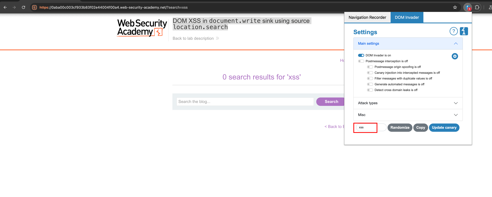
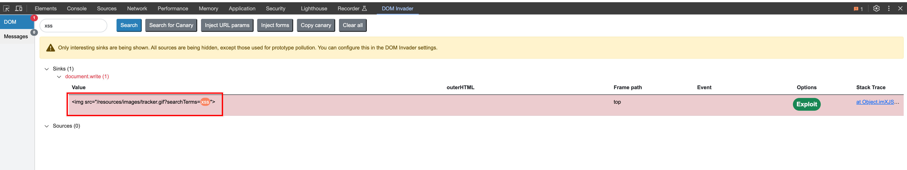
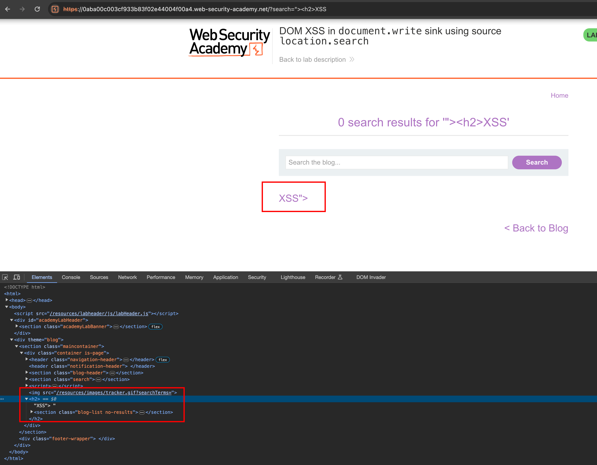
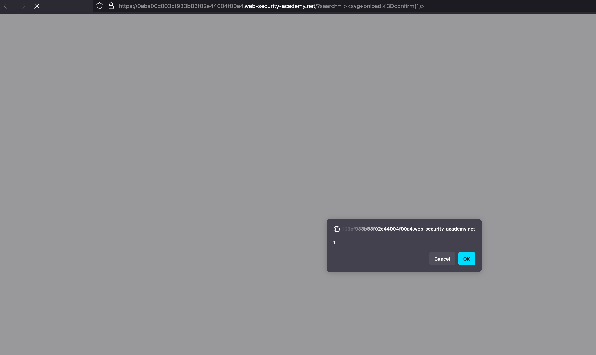

## Intro 

This lab contains a DOM-based XSS in the search query. It uses document.write function to writes data out to the page. The function is called with data from location.search, which you can control using the website URL.

## Solution

The spinned instance looks like what we faced in our reflected XSS but this is different case where we have exploit dom XSS here in the search tab 

Using DOM invader, we can update our canary somethings like `xss` and let's see whether it meets in source sinks 

Analysing the dom invader tab in chromium, the canary is being ended inside `` tag where we have break it in order to trigger an XSS

With the actual HTML payload `"><h2>XSS` where we indeed break the image tag and our HTML tag got executed 

It works right !!! and Now we with the following `"><svg onload=confirm(1)>` we break out of the `` tag and our payload will get executed 

