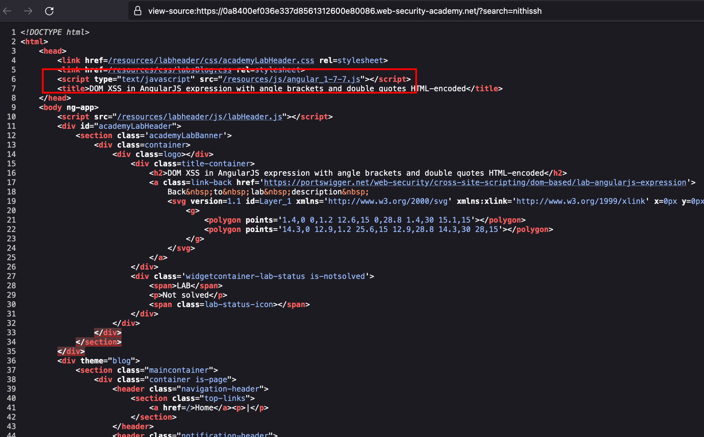
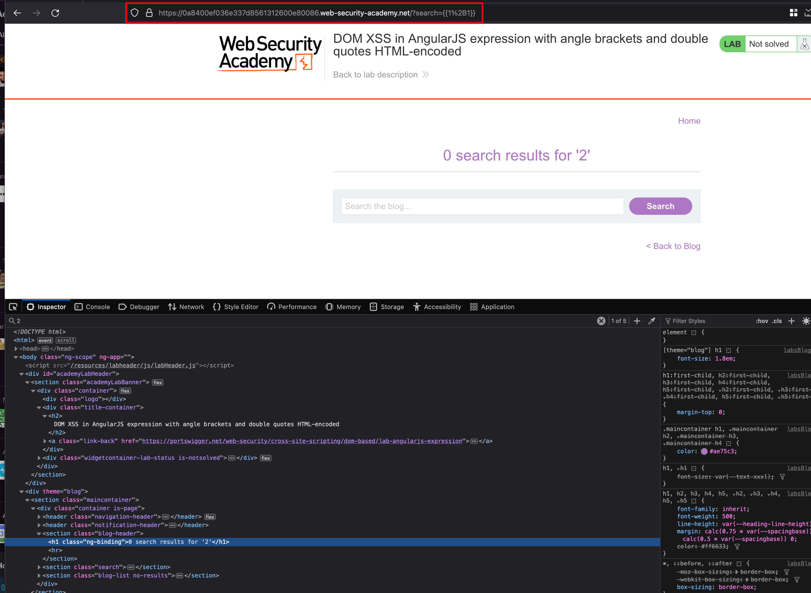
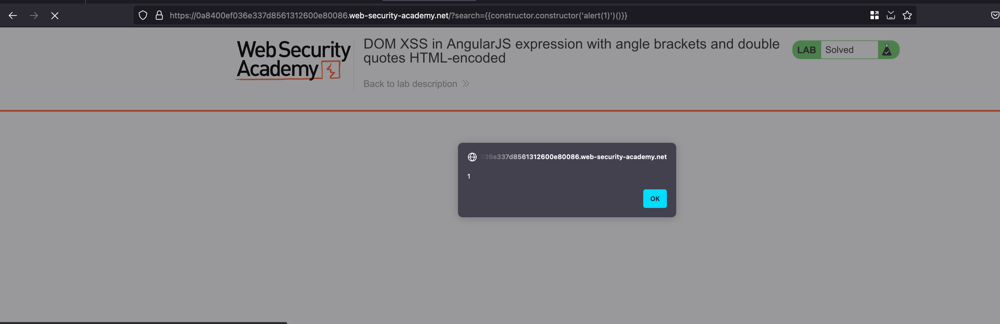

## Intro

This lab contains a DOM-based cross-site scripting vulnerability in a AngularJS expression within the search functionality.

AngularJS is a popular JavaScript library, which scans the contents of HTML nodes containing the ng-app attribute (also known as an AngularJS directive). When a directive is added to the HTML code, you can execute JavaScript expressions within double curly braces. This technique is useful when angle brackets are being encoded. 

## Solution

In this lab, we do have a search functionality and looking into the source of the page and found that the angular JS being used versionn `1.7.7`

After doing R&D about this specific XSS with an angular bracket and for example, In the search field entering the following payload `{{1 + 1}}` results in `2` 

Great, I've found the following payload somewhere on internet `{{constructor.constructor('alert(1)')()}}` where through constructor we can pop an alert and Entered the following payload on search and triggers an XSS and the lab is solved 

