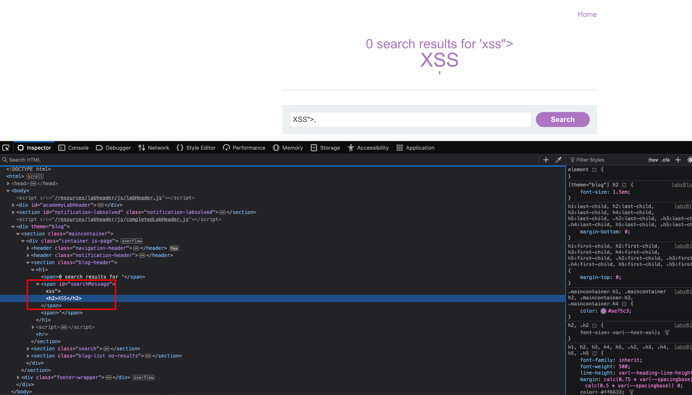
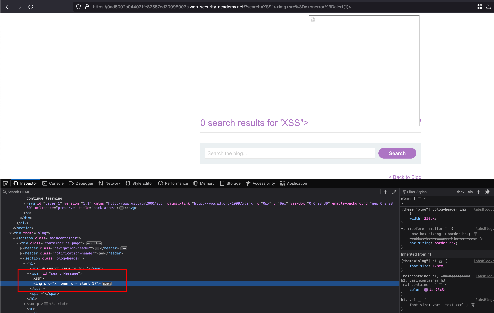
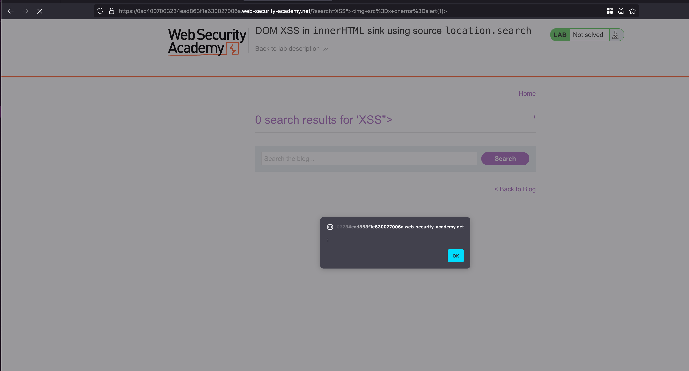

## Intro

This lab contains a DOM-based cross-site scripting vulnerability in the search blog functionality. It uses an innerHTML assignment, which changes the HTML contents of a div element, using data from location.search. 

## Solution

It's like same lab as previous, In the search we can enter the following payload like `"><h2>XSS` and observed that `"` actually broken `` tag and executed the HTML tag 

Well, In that case with the following payload `">` where `"` will actually break the `` tag and rest of the `` tag will get executed 

The XSS pops up 

