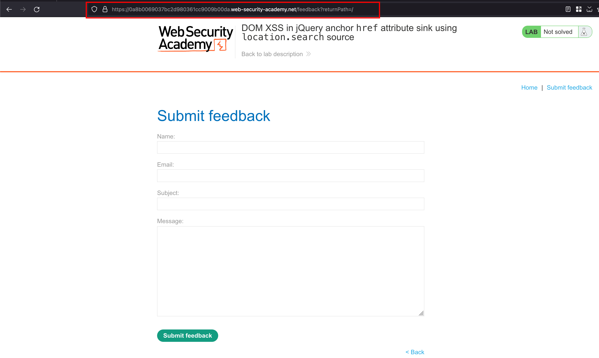
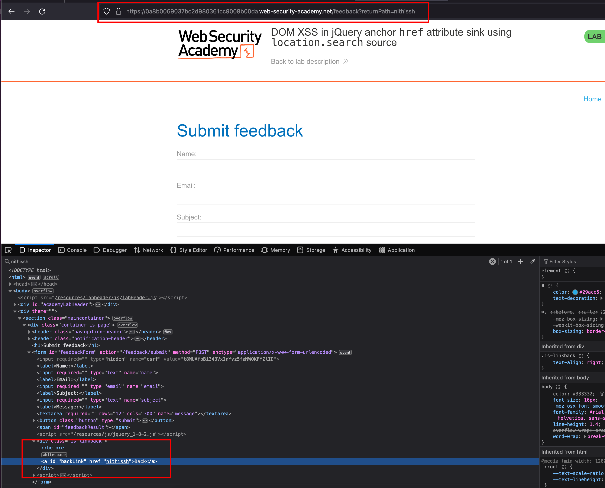
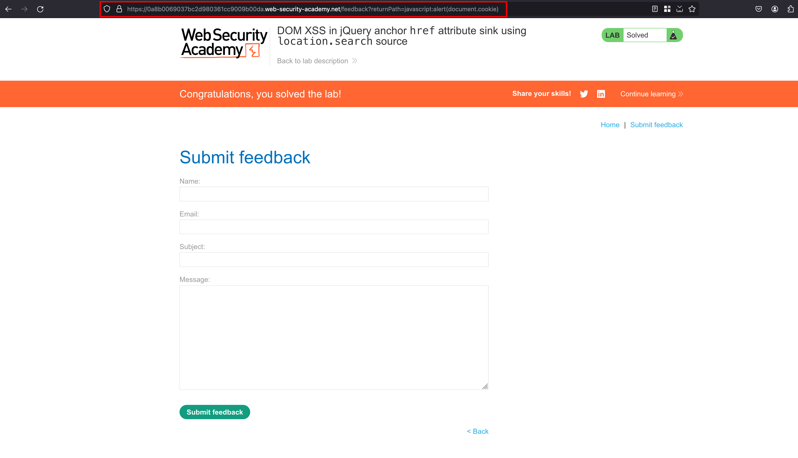

## Intro

This lab contains a DOM-based cross-site scripting vulnerability in the submit feedback page. It uses the jQuery library's $ selector function to find an anchor element, and changes its href attribute using data from location.search. 

 To solve this lab, make the "back" link **alert(document.domain)**. 

## Solution

Like a previous labs where we faced a blog forum but in this lab, we have an additional feature called `Submit feedback`

Once after going the `Submit feedback` feature we have new parameter called `?returnPath=` 

For an instance in the `returnPath` parameter, I've entered a random text something like my name `nithissh` where it is reflected in the response inside `href` attribute 

Since it is getting reflected inside `href` tag we can add the following payload which `javascript:alert(document.cookie)` on to the `?returnPath=` parameter as an value and after sending the request, our lab is solved

