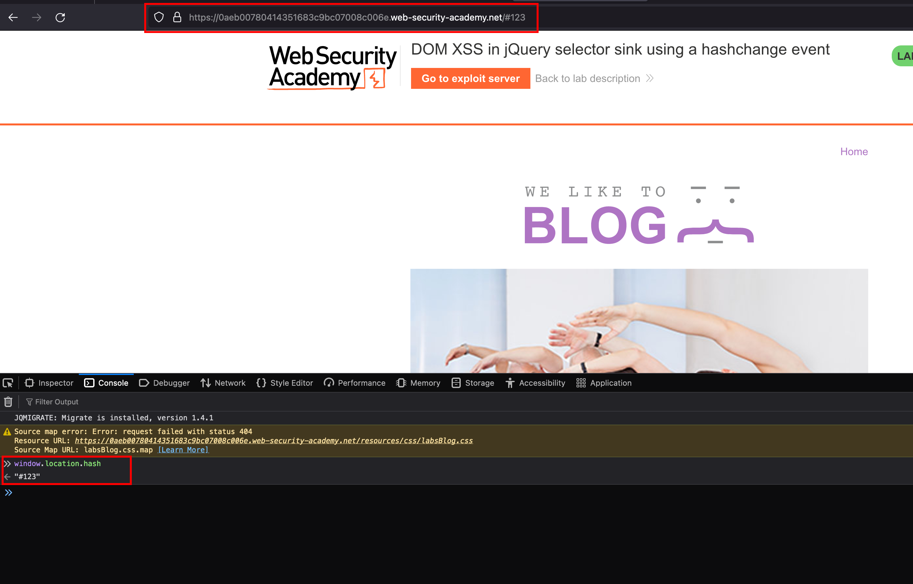
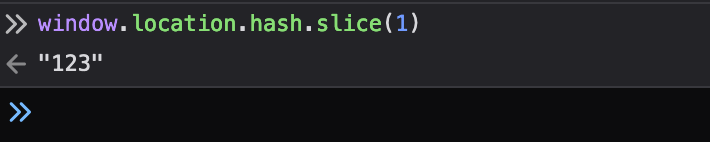
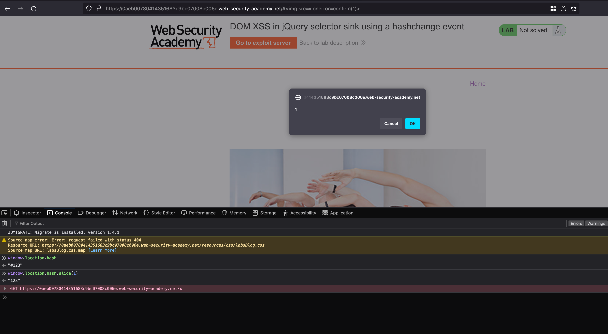
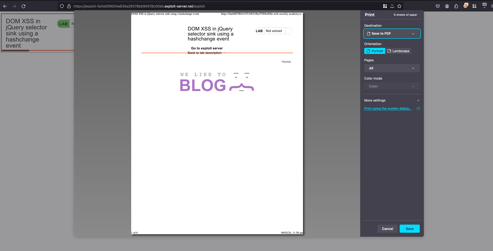
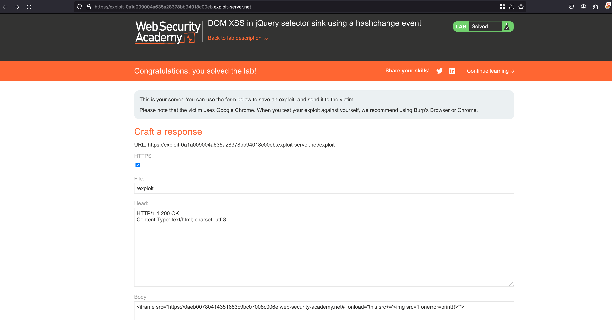

## Intro

This lab contains a DOM-based cross-site scripting vulnerability on the home page. It uses jQuery's $() selector function to auto-scroll to a given post, whose title is passed via the location.hash property. 

## Solution 

We found the following the hashchange function in the source code 

```js
$(window).on('hashchange', function(){
                            var post = $('section.blog-list h2:contains(' + decodeURIComponent(window.location.hash.slice(1)) + ')');
                            if (post) post.get(0).scrollIntoView();
                        });
```

This code listens for changes in the URL hash (the part of the URL after the # symbol). When the hash changes, it searches for a **heading (h2)** inside a section with the class **"blog-list"** that contains the text specified in the hash (after decoding it from URL format). If it finds such a heading, it scrolls the page to bring that heading into view.

When passing a the following hash which `#123` in the URL and checking the `window.location.hash` in dev console, the value `#123` will be stored




When `window.location.hash.slice(1);` is passed, the values after the `#` values will be reflected 




In the above source, we found that it takes the values from **window.location.hash.slice(1)** when we pass the following payload `#` where it will slice out values after the hash value and xss will pop up which is actually a self XSS indeed 




### According to Burp Documentation

 To actually exploit this classic vulnerability, you'll need to find a way to trigger a hashchange event without user interaction. One of the simplest ways of doing this is to deliver your exploit via an iframe:

```js
<iframe src="https://vulnerable-website.com#" onload="this.src+=''">
````

In this example, the src attribute points to the vulnerable page with an empty hash value. When the iframe is loaded, an XSS vector is appended to the hash, causing the hashchange event to fire. 


Continuing with our solution, where we can use the same payload in the URL after the hash value and view the exploit in `Exploit server` we can see the `print()` pops up

> To be noted, we need to replace the vulnerable-website with our actual lab URL 





Yay !! the exploit worked out right and now click on `deliver to victim` and lab will solved 



