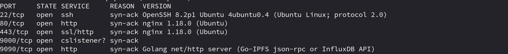

## Introduction

I'm excited to share an intriguing story with you about how I uncovered the IP address of an internal host using JavaScript code. While conducting a port scan, I detected an **open port 9000**, revealing a running Grafana instance. By querying the Shodan database for port 9000 and specifically searching for Grafana, I stumbled upon **approximately 134 results**. Surprisingly, a substantial

## Discovery Phase

After completing the reconnaissance phase in Lark, I stumbled upon a new subdomain that hadn't existed in my previous tests. While it mirrored the main domain in functionality, there was a crucial difference – the primary subdomain was protected by a WAF and had analytics in place, albeit cluttered with irrelevant data. On the flip side, the newly discovered domain functioned similarly but lacked a WAF, and no analytics were running. Intrigued, I decided to delve into its source code, only to find nothing of significance.

However, the plot thickened upon authentication. As I delved deeper into the source code, a JavaScript file named main.js surfaced. This file was responsible for managing databases and maintaining authenticated user records through Grafana.

As previously mentioned, the role of JavaScript files in handling Grafana functionality cannot be overstated. Surprisingly, the JavaScript code unintentionally exposes the IP address of the internal Grafana instance within its source code.

## Exploitation Phase

Following the acquisition of the IP address from the JavaScript file, I initiated a port scan using Nmap, and the results turned out to be quite fascinating. Notably, **ports 9000 and 9090 were found to be active**. Port 9090, specifically, was open and hosted an HTTP server in Golang. This server played a crucial role in facilitating a connection between the InfluxDB and the server, managing the storage and retrieval of data on the server.

However, upon accessing port 9000 through the browser, we can freely view, edit, or access Grafana instances without the need for authentication.

## Conclusion

In conclusion, remember to thoroughly examine source codes both before and after authentication, as they often unveil hidden insights. If you chance upon staging or production domains mirroring the main domain's functionality, take the opportunity to investigate and experiment. Persistence and patience are key virtues in bug hunting, so don't lose hope. Thank you for reading my writeup; I trust you've gained valuable insights. Happy learning! 😊