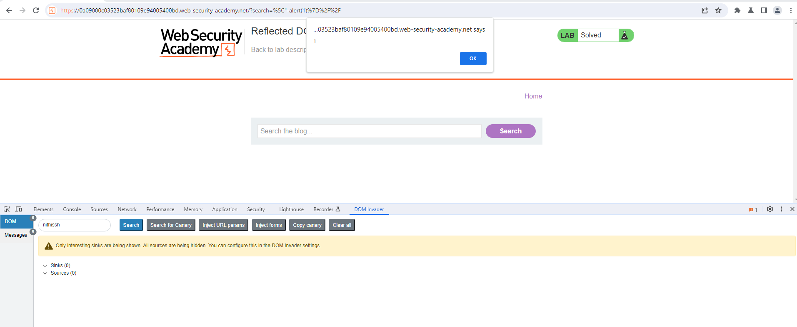

## Intro 

This lab demonstrates a reflected DOM vulnerability. Reflected DOM vulnerabilities occur when the server-side application processes data from a request and echoes the data in the response. A script on the page then processes the reflected data in an unsafe way, ultimately writing it to a dangerous sink. 

To solve this lab, create an injection that calls the `alert()` function. 

## Solution

For an ease of convinence, we can open the spinned instance lab in chromium browser inside burpsuite and look of it makes sense that it is a blog page with a search functioality 

With the DOM invader we have updated the canary to my name for an example like `nithissh` and in the search functionality searched for the term `nithissh` and checking out the `DOM invader console` found it's in `eval()` sink where the possibility of javascript injection is high 

With the following payload `\"-alert(1)}//` we were able to trigger an XSS and lab is solved 

Well the reason behind that we are in the context of a string inside a JavaScript object. So you need to keep the string in a correct format for the payload to execute. By including the + or - you make sure the string does not break.

Plus is a proper way to concatenate strings. Concatenating a string with a void function results in the string "undefined" being added to the original and is therefor a valid statement.

Dash or minus does a subtraction from the string, which in JavaScript results in NaN and is therefore allowed too.