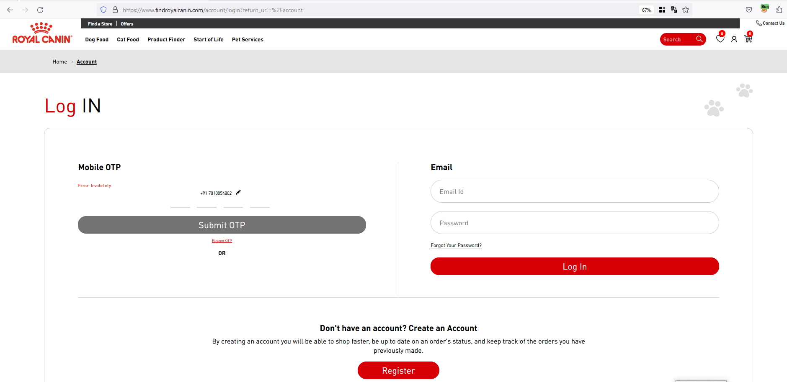
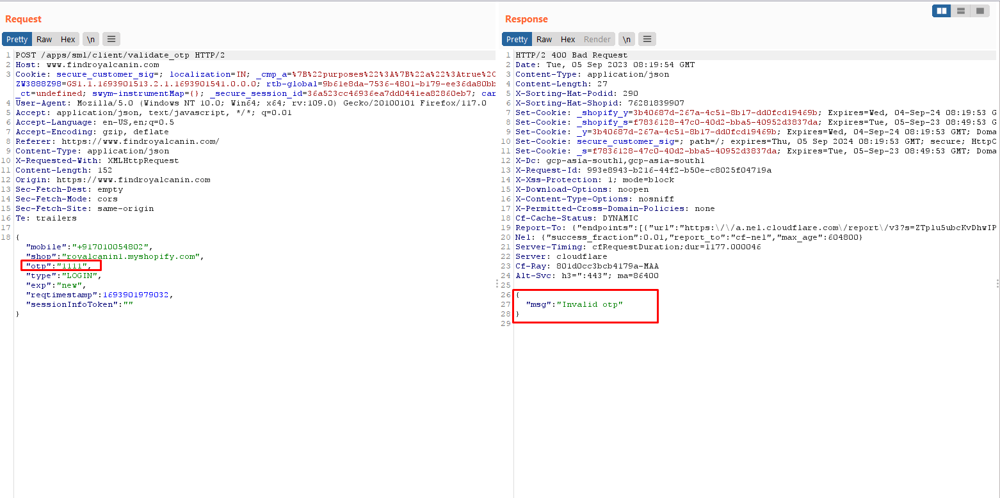
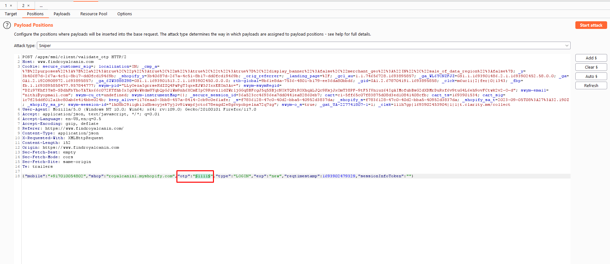
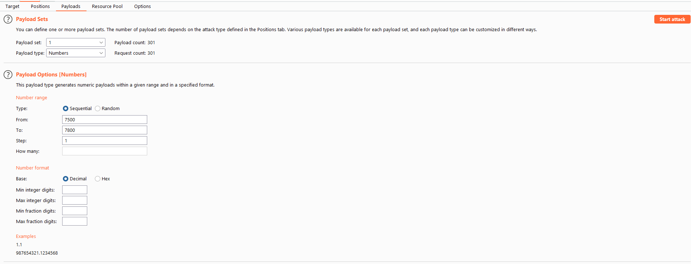
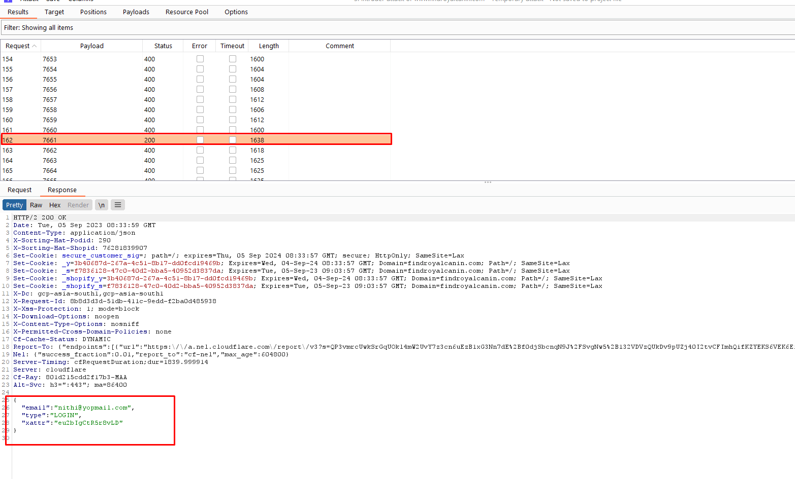
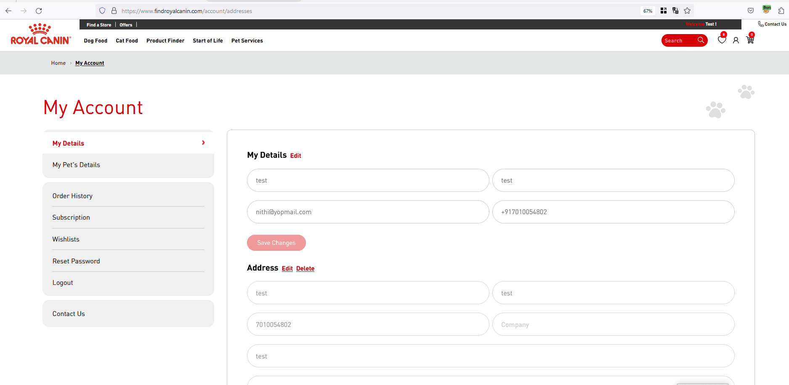

## Product Intro

Royal Canin, a global pet nutrition leader, was founded by French veterinary surgeon Jean Cathary. Recognizing the vital role of nutrition in pets' health, he established the company after successfully treating conditions with a cereal-based diet. In 1956, Royal Canin pioneered dry pet food production in France, using an imported extruder. Acquired by Mars, Incorporated in 2002, the company remains dedicated to advancing pet nutrition worldwide.

## Intro to Vulnerability

After successfully creating an account and logging out, the next step is often the routine process of logging back in using a One-Time Password (OTP). Here's the usual flow: upon entering your registered mobile number, you're prompted to input a 4-digit OTP. Your mobile device then receives this 4-digit code, and upon correctly entering it, you gain access. However, there's a vulnerability in this seemingly secure process—there's no rate limit in place, making it susceptible to brute force attacks. In simpler terms, this flaw allows malicious actors to repeatedly attempt different OTP combinations until they successfully breach the system

To illustrate, take a look at the vulnerable request code snippet below, exposing a potential security gap in the system:

```http
POST /apps/sml/client/validate_otp HTTP/1.1
Host: www.findroyalcanin.com
User-Agent: Mozilla/5.0 (Windows NT 10.0; Win64; x64; rv:109.0) Gecko/20100101 Firefox/117.0
Accept: application/json, text/javascript, */*; q=0.01
Accept-Language: en-US,en;q=0.5
Accept-Encoding: gzip, deflate
Referer: https://www.findroyalcanin.com/
Content-Type: application/json
X-Requested-With: XMLHttpRequest
Content-Length: 152
Origin: https://www.findroyalcanin.com
Sec-Fetch-Dest: empty
Sec-Fetch-Mode: cors
Sec-Fetch-Site: same-origin
Te: trailers
Connection: close

{"mobile":"+917010054802","shop":"royalcanin1.myshopify.com","otp":"1111","type":"LOGIN","exp":"new","reqtimestamp":1693901711832,"sessionInfoToken":""}
```

## Exploiting the Issue

Initiate the logout process first, and observe the appearance of the login page.



For the Mobile OTP exploit, input the registered mobile number and proceed to the 4-digit OTP entry prompt. Use a random OTP, such as **1111**, and intercept the request in Burp Suite. Send the intercepted request to Repeater. Upon sending the request, the system responds with **"Invalid OTP."**



Upon sending the correct OTP, the system responds with sensitive cookie information. Upon opening this response in the browser, it triggers an automatic login into the associated account, completing this exploitative flow.


After logging out again, repeat step 2 and send the intercepted request to Intruder. Set the placeholder on the OTP field and configure the payload with numbers ranging from **7500 to 7800**. While the potential range for brute force is **0000 to 9999**, optimizing efficiency, we currently send only **300 requests**, ensuring the valid OTP falls within this limited range.



Configuring the payload in Burp Intruder to initiate a brute-force attack on the OTP field.



After launching the attack, within a few minutes, you can observe in the image below that at the **162nd request**, the obtained OTP is **7661**.



Furthermore, upon opening the response in the browser, it redirects us to the account settings page, providing clear evidence of a successful account takeover.



## Impact

The absence of a rate limit in the mobile OTP login process creates a severe security loophole, jeopardizing the overall integrity of the website. In a practical scenario, a malicious actor could systematically harvest customer mobile numbers from diverse sources. By exploiting this vulnerability, the attacker gains the ability to compromise user accounts, leading to unauthorized access to the website.

This breach not only compromises user accounts but also poses a direct threat to the website's functionality. Customers who log in to purchase cat and dog products could unwittingly fall victim to unauthorized access, potentially resulting in fraudulent transactions, misuse of personal information, and an overall erosion of trust in the platform.