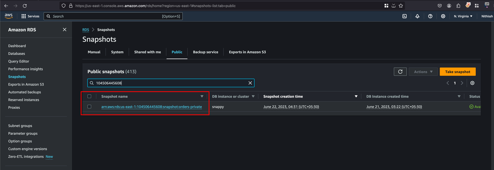
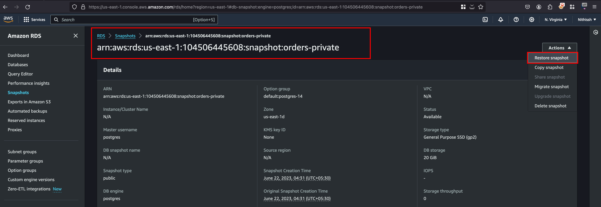
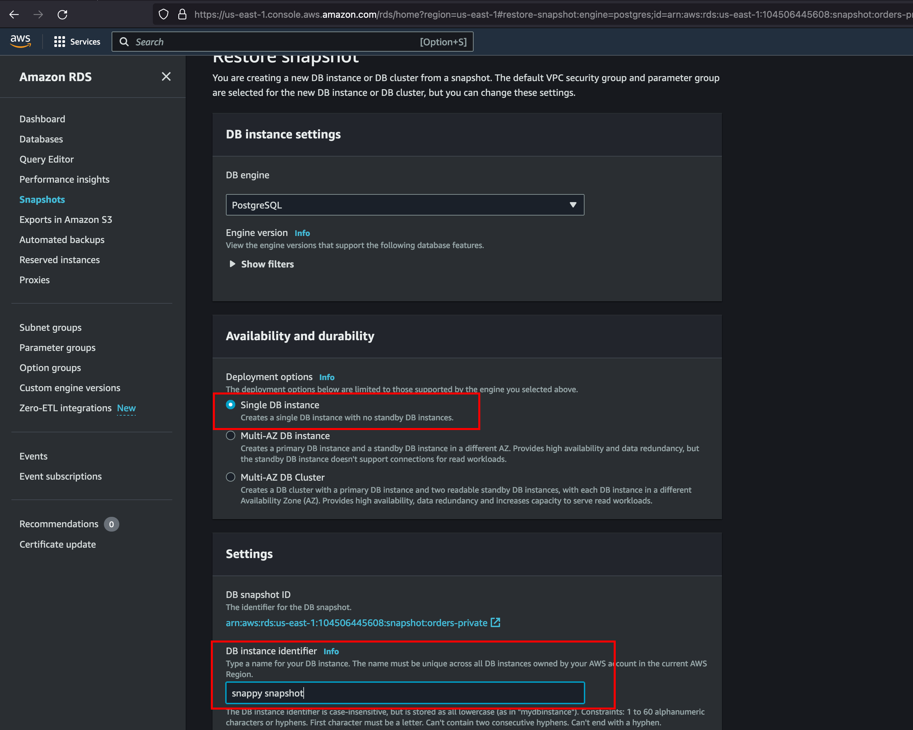
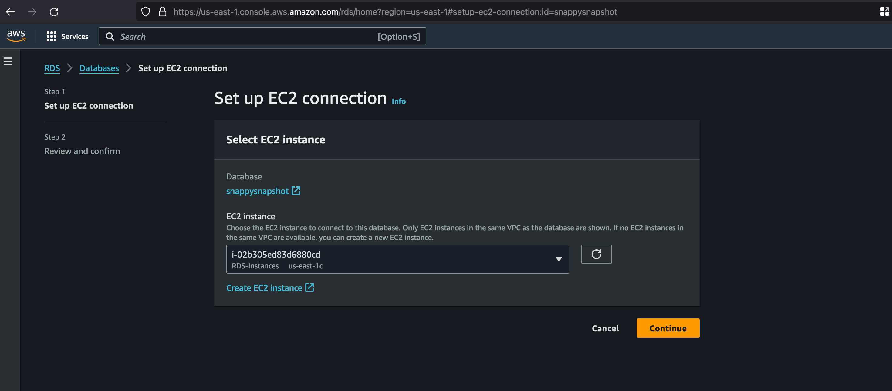
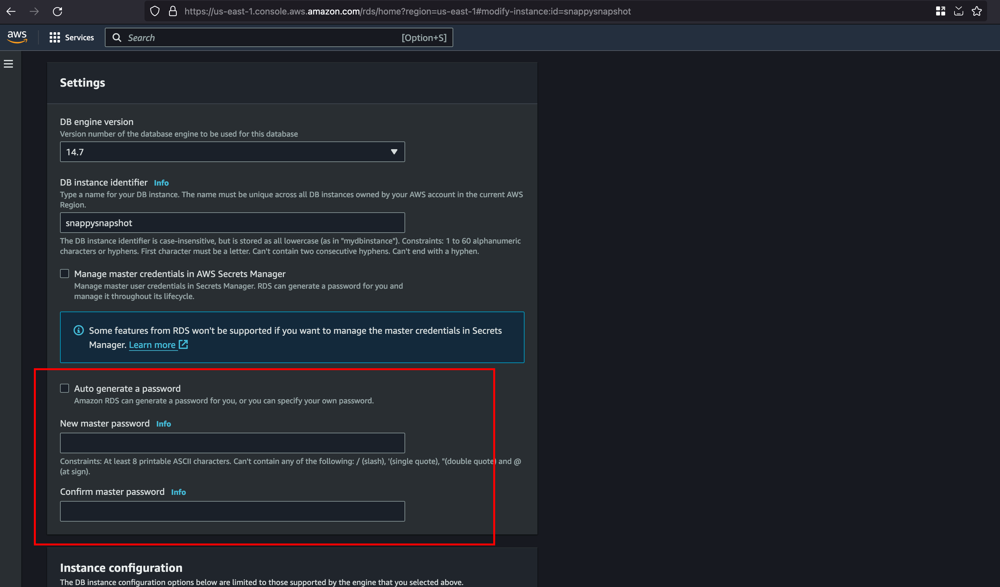
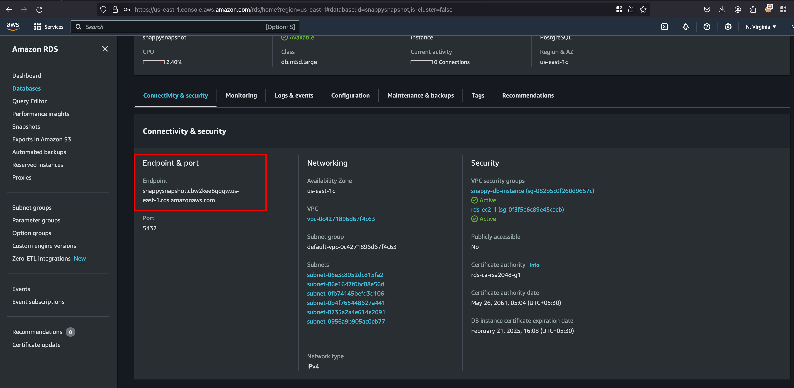

# Plunder Public RDS snapshots 

The scenario here is Huge Logistics, a global logistics leader, has enlisted your team's expertise for an external security review of their cloud infrastructure. Starting with the provided AWS Account ID, your task is to uncover security flaws within their AWS environment and demonstrate the potential risks they pose. Every finding will bolster their defense against future threats.

  

## As an initial entry point,

  

|     |     |
| --- | --- |
| Type | Value |
| Account ID | ‎104506445608<br> |

  

##   

## Solution

As an initial entry point, we have provided with the following account number `104506445608` and looking into the following [docs](https://docs.aws.amazon.com/AmazonRDS/latest/UserGuide/USER_ShareSnapshot.html "https://docs.aws.amazon.com/AmazonRDS/latest/UserGuide/USER_ShareSnapshot.html") we can able to enumerate the publicly available RDS snapshots and grep for the public snapshots owned by the account using account number

  

```
nits@FWS-CHE-LT-8869 ~ % aws rds describe-db-snapshots --snapshot-type public --include-public --profile mycreds | grep 104506445608
            "DBSnapshotIdentifier": "arn:aws:rds:us-east-1:104506445608:snapshot:orders-private",
            "DBSnapshotArn": "arn:aws:rds:us-east-1:104506445608:snapshot:orders-private",
```

  

Looking into the command output results, we can see that the RDS snapshot is hosted in `us-east-1` region and snapshot name is `orders-private` and in order to takeover the RDS snapshot. we need to do few things like the first thing in our own AWS console change the region to `us-east-1` and secondly, we can move over to the RDS services and click on services and search for `orders-private` or you can even use the `104506445608` which is our account ID through we gathered information if you remember 

  

 

  

Click on the snapshot name and once you move inside you will see `actions` tab and In that you can click on `Restore Snapshot` 

  

  

  

Now, we gonna setup the availability to `single db instances` and with identifier name as `Snappy Shapshot`  

  

 

  

Further, we can opt to create a new VPC group named as `snappy-db-instance` and we need to restrict access to public and for that reason, we can set the `Public Access`  to `No` 

  

 

  

Awesome, Once you click on `Restore snapshot`  It will take sometime and spin up the RDS instance 

  

 

  

Now In order to connect the RDS instances with a EC2, we need to create a new EC2 instance in the same availability zone as this which is in our case `us-east-1c` 

  

 

  

We can go back to the RDS services and once after going inside, you will have option to `setup EC2 connection`  through the `actions` tab and select the EC2 instance and click on continue 

  

 

  

And you will recieve the following message to confirm that our connection is successful

  

 

  

There is one catch here, well you know we have configured everything but one thing we missed out which is setting up the password for the database also know as `Master Password`  and for that click on modify and under `DB Instance identifier`  you will fields for setting up the password

  

 

  

Once after click on the continue in the modification page, you will be faced with a prompt and set it to apply immediately and presented with the following message 

  

 

  

In order to connect to the RDS endpoint we need few things, Firstly this instance is based on `PostgreSQL` and for that you need a `psql-client` on your system and secondly, the endpoint of this RDS instance and we can find this under `Conectivity and Security` 

  

 

  

Let’s connect to our EC2 instance and install `postgresql-client`  with the following command sudo apt-get install -y postgresql-client and connect it to `Postgresql` with the following command `psql -h snappysnapshot.cbw2kee8qqqw.us-east-1.rds.amazonaws.com -U postgres`

  

```bash
ubuntu@ip-172-31-41-191:~$ psql -h snappysnapshot.cbw2kee8qqqw.us-east-1.rds.amazonaws.com -U postgres
Password for user postgres: 
psql (14.10 (Ubuntu 14.10-0ubuntu0.22.04.1), server 14.7)
SSL connection (protocol: TLSv1.2, cipher: ECDHE-RSA-AES256-GCM-SHA384, bits: 256, compression: off)
Type "help" for help.

postgres=> 
```

  

Now `\list` we can query the list of databases and found that the database `cust_orders` looks interesting and we can change it to that using `\c cust_orders`  and followed `\dt` to display or dump out the tables

  

```sql
postgres=> \list
                                   List of databases
    Name     |  Owner   | Encoding |   Collate   |    Ctype    |   Access privileges   
-------------+----------+----------+-------------+-------------+-----------------------
 cust_orders | postgres | UTF8     | en_US.UTF-8 | en_US.UTF-8 | 
 postgres    | postgres | UTF8     | en_US.UTF-8 | en_US.UTF-8 | 
 rdsadmin    | rdsadmin | UTF8     | en_US.UTF-8 | en_US.UTF-8 | rdsadmin=CTc/rdsadmin+
             |          |          |             |             | rdstopmgr=Tc/rdsadmin
 template0   | rdsadmin | UTF8     | en_US.UTF-8 | en_US.UTF-8 | =c/rdsadmin          +
             |          |          |             |             | rdsadmin=CTc/rdsadmin
 template1   | postgres | UTF8     | en_US.UTF-8 | en_US.UTF-8 | =c/postgres          +
             |          |          |             |             | postgres=CTc/postgres
(5 rows)

postgres=> \c custom_orders
connection to server at "snappysnapshot.cbw2kee8qqqw.us-east-1.rds.amazonaws.com" (172.31.43.167), port 5432 failed: FATAL:  database "custom_orders" does not exist
Previous connection kept
postgres=> \c cust_orders
psql (14.10 (Ubuntu 14.10-0ubuntu0.22.04.1), server 14.7)
SSL connection (protocol: TLSv1.2, cipher: ECDHE-RSA-AES256-GCM-SHA384, bits: 256, compression: off)
You are now connected to database "cust_orders" as user "postgres".
cust_orders=> \dt
         List of relations
 Schema |  Name  | Type  |  Owner   
--------+--------+-------+----------
 public | flag   | table | postgres
 public | orders | table | postgres
(2 rows)
```

  

In the Public schema, Under `flag` we can get our flag through `SELECT * FROM flag;`  which will dump out our flag 

  

```sql
cust_orders=> select * FROM flag;
               flag               
----------------------------------
 6e1b93d735aa69a05f92155f1b4fd855
(1 row)
```