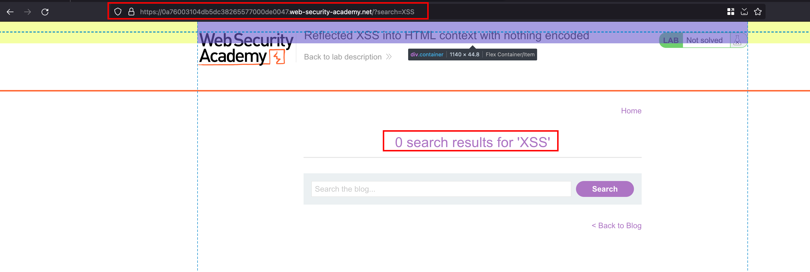
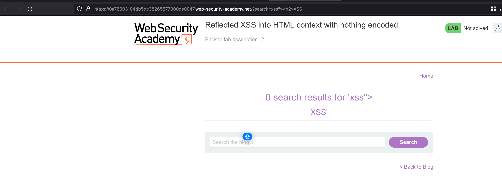
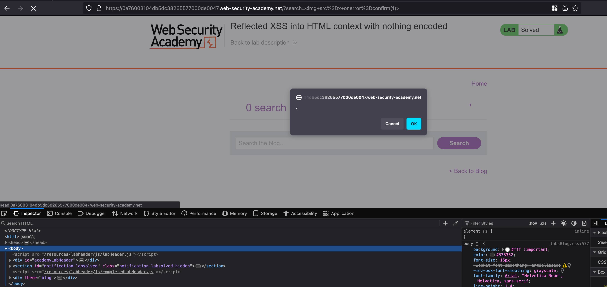

## Intro

Welcome to our pod! Today, we're tackling XSS vulnerabilities in HTML contexts with no encoding. Our blog forum allows users to post, with featured blogs showcased on top. We'll test this vulnerability by injecting simple HTML like `<h2>XSS` and then escalate with an XSS payload like `` to see if execution occurs. Let's dive in!"

## Solution

This is a blog forum where the users may post and featured blogs are appears on the top 

If we search for the random text like for our `XSS`  i’m searching and it is getting reflected in the response through the `?search=`  parameter 

Ok, awesome let’s try for a simple HTML Injection payload and let’s see if there is any execution and for the example I’m trying `<h2>XSS`  where XSS text appears as a **Heading 2**

Now let’s try for an XSS payload like ``  where the payload executes and if the error appear there will be a xss popup and lab will be solved 

## Takeaway

XSS vulnerabilities in HTML contexts without encoding can lead to malicious code execution. Always sanitize user input to prevent such attacks

