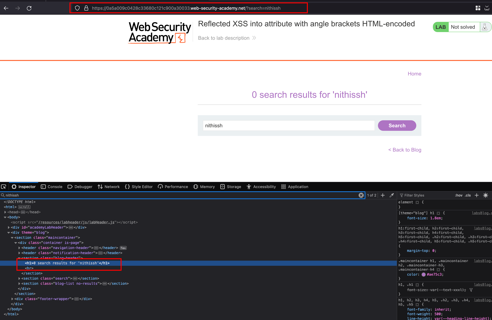
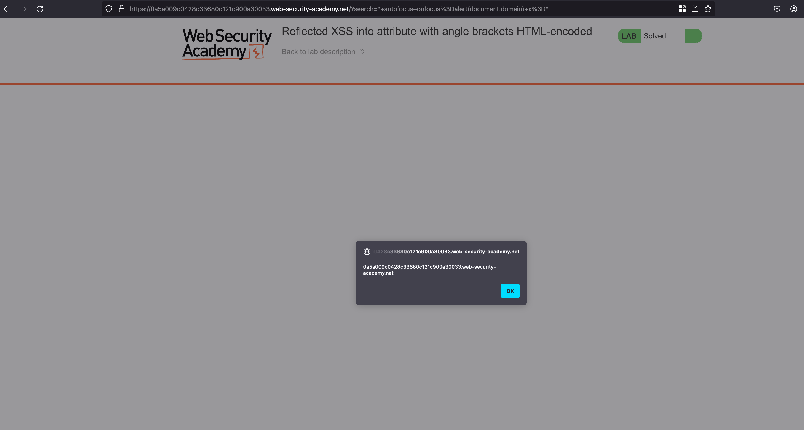

## Intro 

This lab contains a reflected cross-site scripting vulnerability in the search blog functionality where angle brackets are HTML-encoded. To solve this lab, perform a cross-site scripting attack that injects an attribute and calls the alert function

## Solution

In this lab, we have a `search` functionality where we can search it for anything in the blog and for example, I searched for my name `nithissh` and ends up reflecting inside the HTML tags 





#### In the Burp documentation 

```html
" autofocus onfocus=alert(document.domain) x="
```

The above payload creates an onfocus event that will execute JavaScript when the element receives the focus, and also adds the autofocus attribute to try to trigger the onfocus event automatically without any user interaction. Finally, it adds x=" to gracefully repair the following markup. 

Add the following payload `" autofocus onfocus=alert(document.domain) x="` inside the `search` parameter as an value and results in XSS popup and lab is solved 


