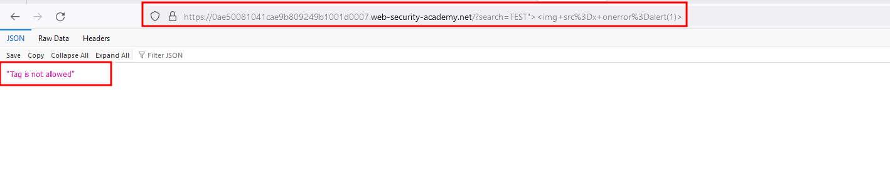
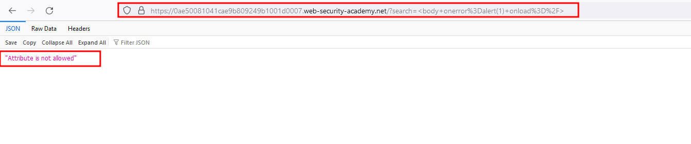
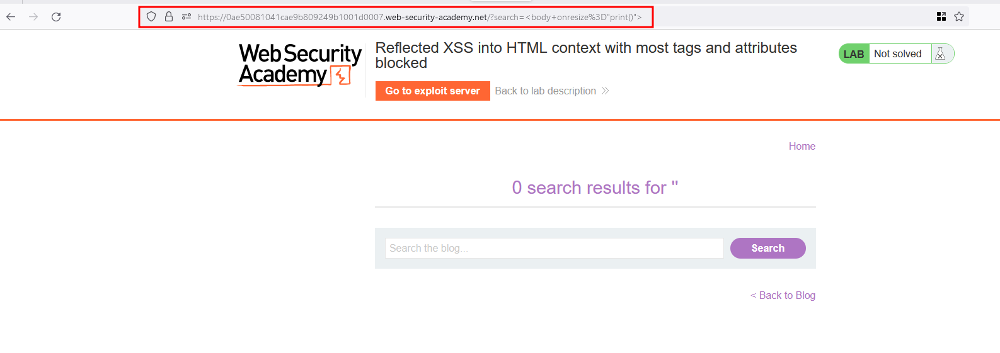
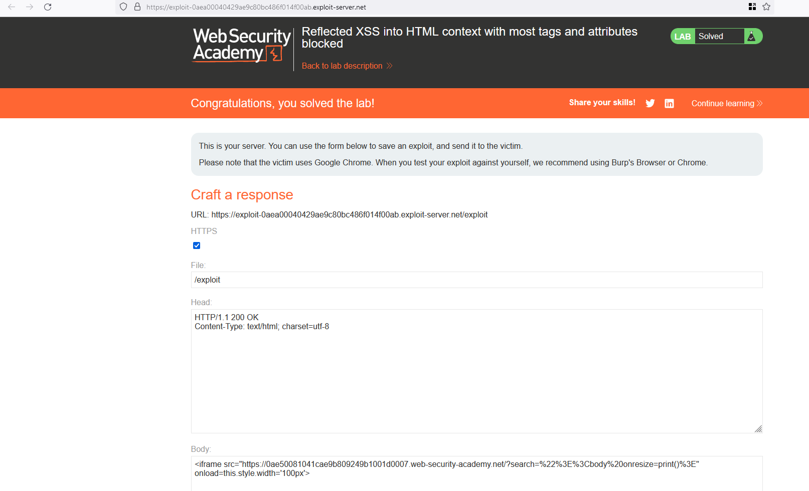

# Intro 

This lab contains a reflected XSS vulnerability in the search functionality but uses a web application firewall (WAF) to protect against common XSS vectors

## Solution

In the search functionality of this application, I've entered the following payload `test"><h2>XSS` to check on how the application evaluting the input and the `<h2>` got executed in a newline 


When entering the complete payload like `test">` in the search functionality and responded with **"No Tags allowed"**




Now I assume that the `` tag is blocked what's the other alternative like I remember we have a `<body>` tag and with the following payload `<body onerror=alert(1) onload=/>` we have bypassed the tag error but we do have a attribute error now 





In our case, `onerror` is the attribute and in order to solve it completely with the following payload `"><body onresize=print()>` the request responds with a 200 status code 




The payload is working right ?, Now let's create a payload which is deliverable to the victim through the exploit server 

**Payload to deliver to victim**

```
<iframe src="https://0ae50081041cae9b809249b1001d0007.web-security-academy.net/?search=%22%3E%3Cbody%20onresize=print()%3E" onload=this.style.width='100px'>
```

Put the following payload into the exploit server in the body data and click on store and then deliver the exploit to the client.. Now the lab will be solved


