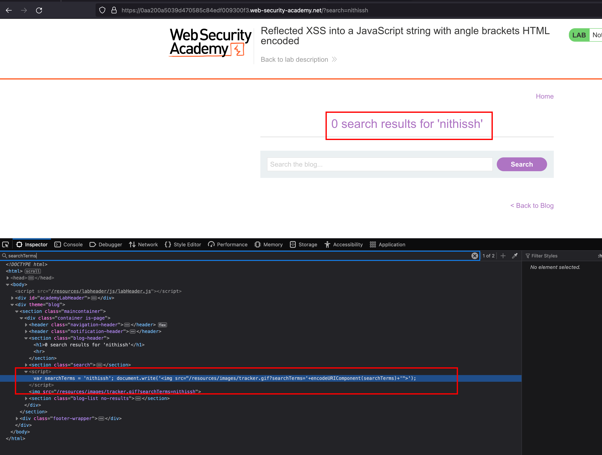
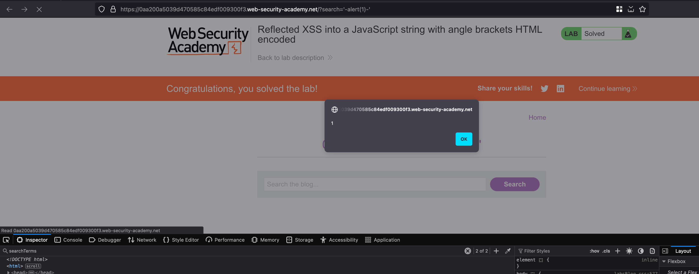

## Intro

 This lab contains a reflected cross-site scripting vulnerability in the search query tracking functionality where angle brackets are encoded. The reflection occurs inside a JavaScript string. To solve this lab, perform a cross-site scripting attack that breaks out of the JavaScript string and calls the alert function. 

## Solution

There is search functionality in our lab, where if we search for anything and values will get reflected inside variable called `searchTerms` in javascript 

With the following payload `'-alert(1)-'` we can actually escape from the **var** value and bypass the need of `>` and `<`

And as a result, there will be XSS popup and lab will be solved 

