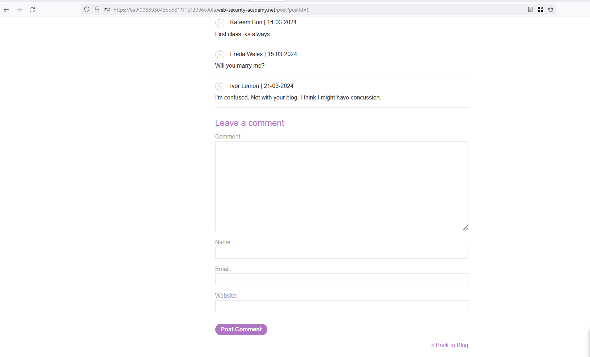
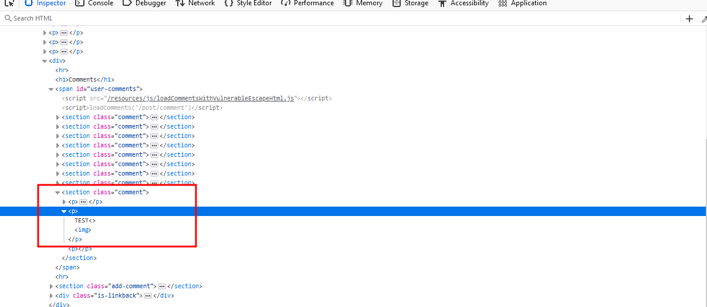
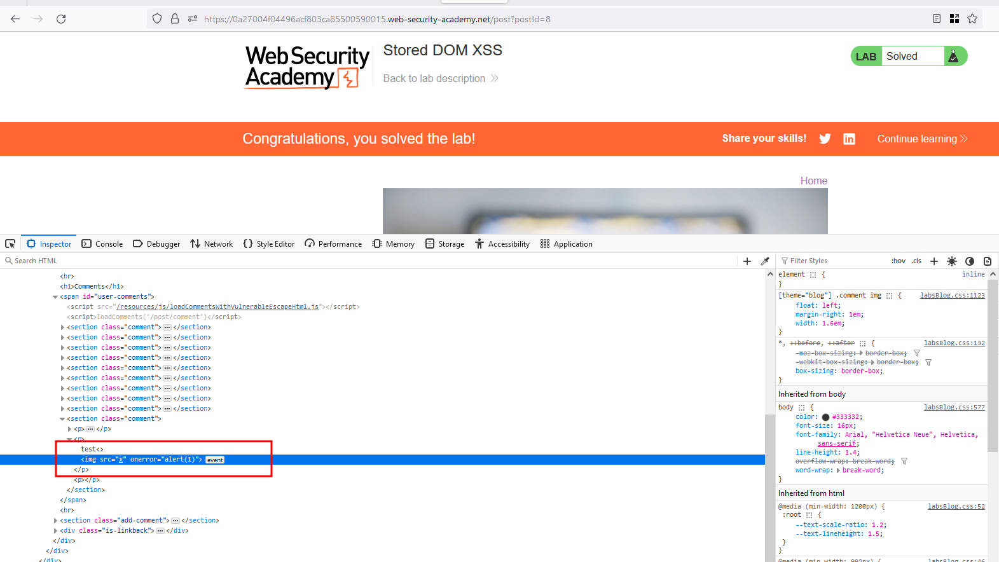

# Intro 

This lab is kind of looks like blog forum where we have a functionality to comment on each blog and our challenge is to exploit a stored DOM based XSS on that feature and trigger an `alert()` to solve the lab 

## Solution 

The functionality which they have mentioned in the challenge is to exploit the blog comment functionality which looks like as follows

Now, In the `Comment` field as always tried the enter the following payload `test"><h2>XSS` and analysing the response resulted in reflecting inside `
` tag 

Now, I was able to escape the `
` with the simple payload `test<>` which is closes the `
` and opens the `` in new line 

Great, and now with the complete payload `test<>` and we were able to trigger an `alert()` function and with that lab is solved 

