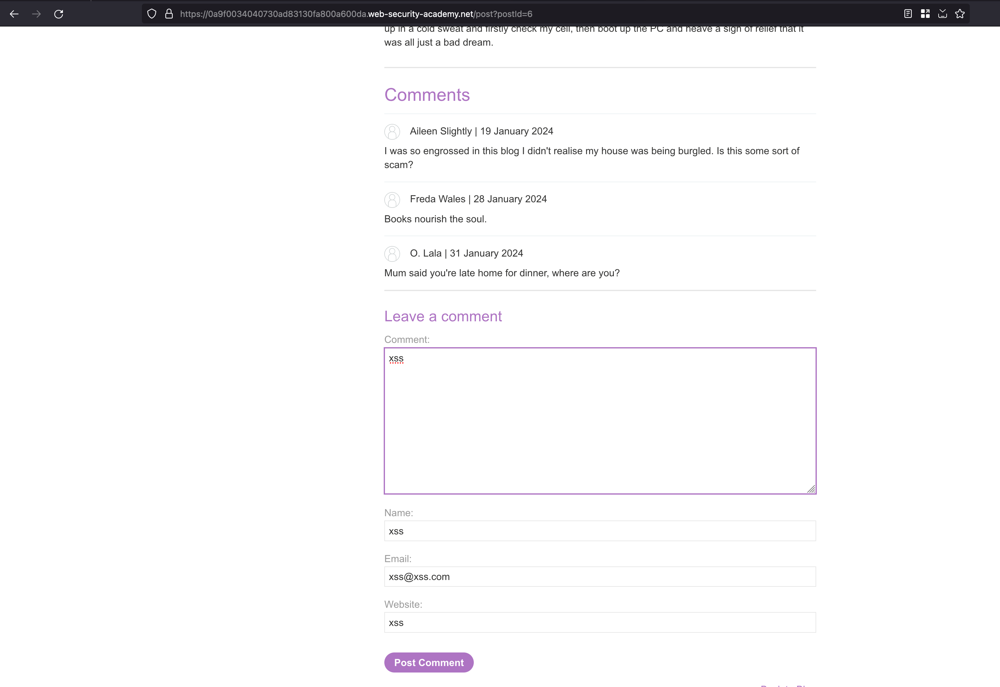
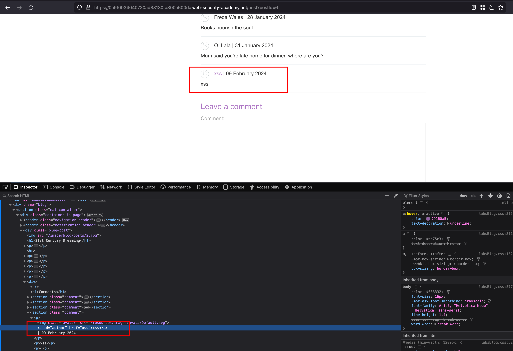
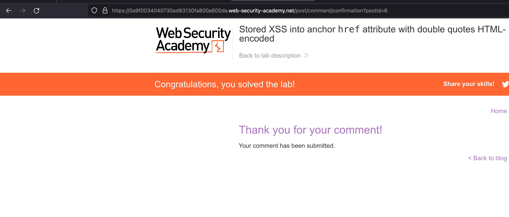
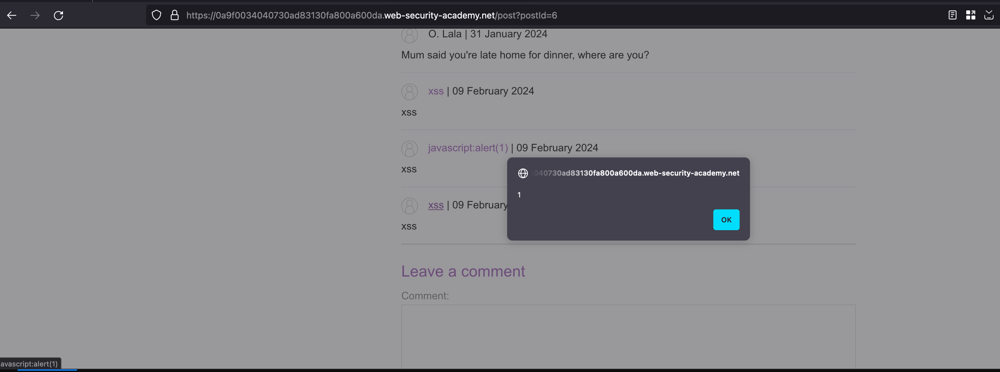

## Intro 

 This lab contains a stored cross-site scripting vulnerability in the comment functionality. To solve this lab, submit a comment that calls the alert function when the comment author name is clicked. 

## Solution

In this lab, we have functionality to comment on that blog where we comment on any name and email address

Once after submiiting for a comment and found that `name` being taken as a `author` reflected inside the `href` attribute 

Now adding the following payload `javascript:alert(1)` as a value inside `Website` field and lab is solved 

Well, Clicking on the hyperlink and executes the payload

