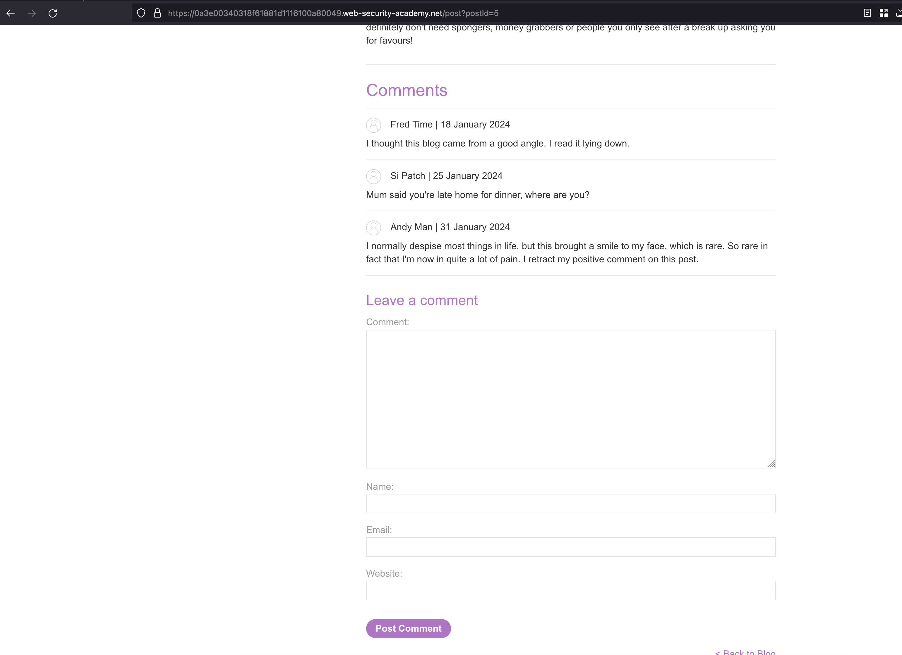
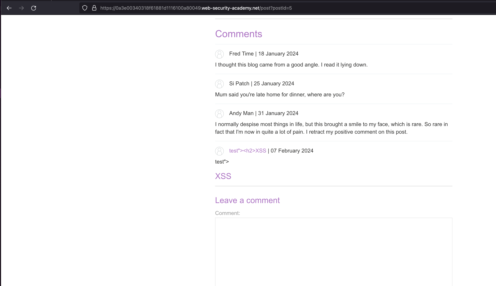
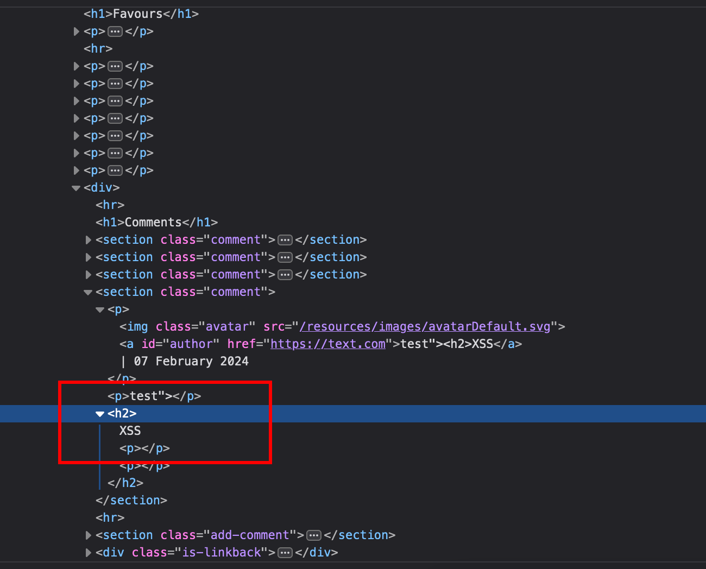
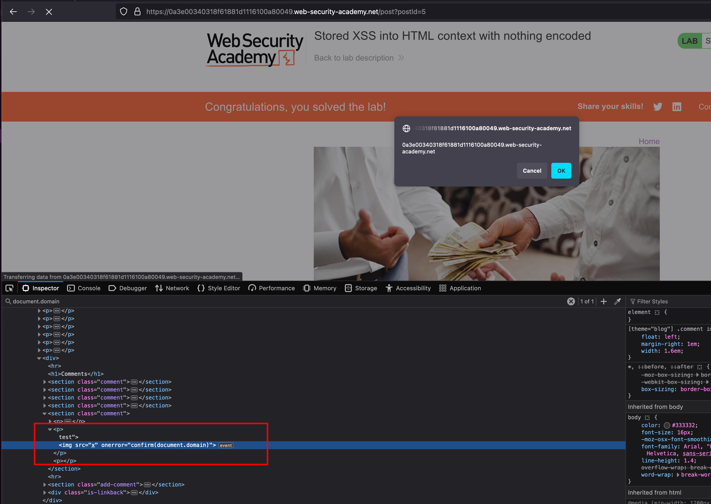

## Intro

In this writeup, we'll explore a PortSwigger XSS lab at an apprentice level, focusing on exploiting stored XSS into an HTML context without the need for encoding. The lab simulates a blog forum where authors can post their blogs. By exploiting a vulnerability in the comment functionality, we'll demonstrate how a simple XSS payload can be injected and executed.

## Solution

Once after spinning the lab, The website looks like a blog forum where the authors can post their own blog 

In the blog forum, after clicking the `view post` we have a functionality to comment on that post 

Determing the input field might be vulnerable to stored XSS.. I've tried injecting it with random html payloads like `"><h2>XSS` on all the fields and fortunately the **comment** field is vulnerable to a stored HTML Injection in our case 

observing the source, we have breaken out of `
` tag and our rest of the `<h2>` payload got injected 

Confirming that we will build a XSS payload `test">` which will break `
` tag and execute the rest of `` tag and our payload will get executed 

