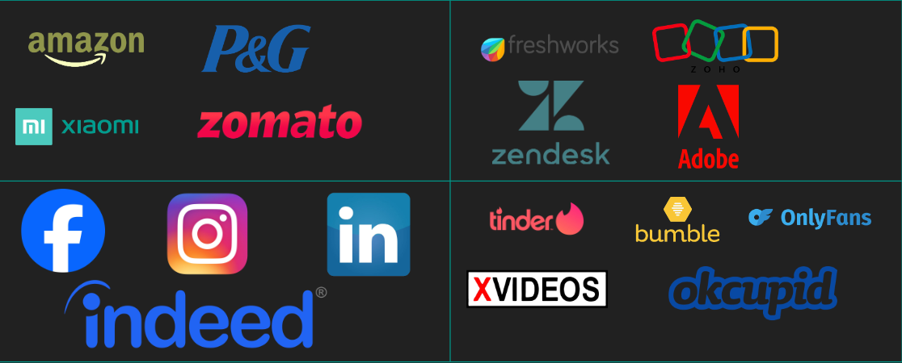
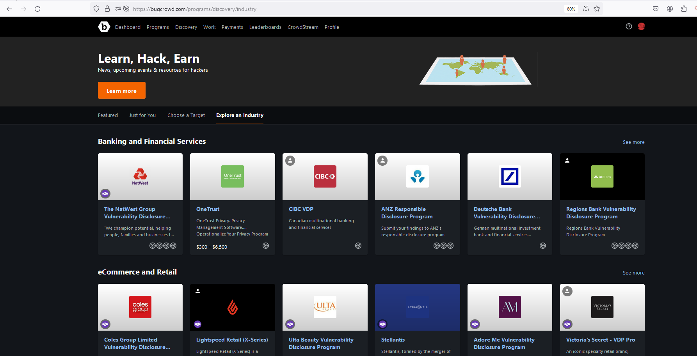
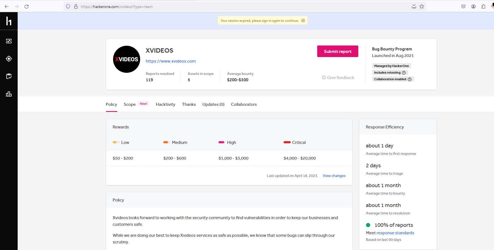
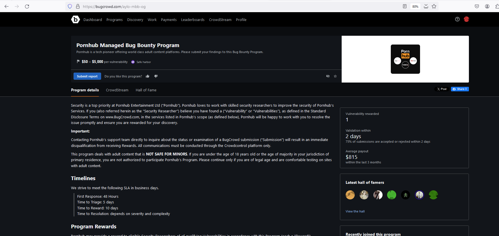

# Introduction 

I've always wondered hacking a application feels like orgasm inside me and more over there is ups and downs like it may be getting a duplicate on your bugbounty report or it may be an invalid bug because it may be intended well obviously there is no mistake security team and well it's on developers or application team that too i realized once after becoming triager for company xD

Well, we're doing well with cash flow in bugbounties, but something doesn't feel right or provide a good learning experience. So one day, after a couple of shots of vodka, a thought struck me: we're focused on security bug classes on individual application flows, but why can't we look at specific industries and see how they've done security? Are they really great?

As a result, I dubbed it **"Theme Based Bugbounty Hunting"**

In the blog, you will learn on choosing a specific subject for bug bounty hunting, how even a simple bug can get larger, and some fresh learnings outro.

## Theme Based Bugbounty Hunting 

"Theme-based bugbounty hunting" sounds fantastic, right!!! But what exactly it is, and how does it work?

As a bugbounty hunter, we usually choose a reputable program with a high payoff, a strong response ratio, and the most crucial factor: how quickly can I receive my bounty?

Because I was high on alcohol, my thinking was a little off. I thought about industry and mapped out the Bugbounty program in a very basic way. In my view, there is a distinct learning curve where I don't care about the response ratio or the triage time; what matters to me is the bounty because it serves as a form of incentive for my work. 

### Industry Mapping 

Mapped out a few bug bounty programs with a nice scope, obviously..good pay and good learning outcomes you can receive from my perspective, and if you are using some kind of application in your normal life, check whether that company has a bug bounty programme. 

If you see how we scroll around Instagram on a regular basis, you will have a better understanding of how the program, features, and certain hidden functions are tested. People who own products from other SaaS firms, such as freshworks, presume that you are a customer for them and that you understand how their product works. Go find weaknesses. Report it to their Bugbounty program or sometimes they do even have their security contact hosted on `/security.txt` according to `RFC-9116`

## Automated way of choosing the industries

The most well-known bug bounty platforms in the modern period include hackerone, synack, intigriti, bugcrowd, and others. Most people would love to choose their bug bounty programs. For example, I personally enjoy hunting for wide-scope targets, such as government programs like the US Department of Defense. If I wanted to hack on single-scope or small-scope targets, I would prefer to target e-commerce, blockchain exchanges, NFTs, and some dating sites, like Bumble or Tinder.

I would advise signing up for Bugcrowd, where we have the ability to look after specific industries through their "Discovery" tab. You can look after specific industries through their "Explore an Industry" functionality. Some people may have burnout or even confusion when choosing the programs. 

With the above capabilities from bugcrowd, we may use it and choose the proper bugbounty program that you like the most, based on the industry explicitly.

## Why I chose Porn and Dating sites as my target

As previously noted, choosing a bug bounty program is entirely dependent on understanding how secure the industry is. It should also be less crowded and have a good resolution time, resulting in fewer duplicates for us. 

I chose the porn and dating theme since, to be honest, I enjoy watching it xD, and I am familiar with the services of the free account but have yet to try their premium plan. The finest thing is that most people do not choose pornographic bounty programs until they live away from their families. This makes us unique, right? Definitely, the cash or bounty is pretty fantastic.  

Let's examine various metrics to help select the best program. 

The first program I selected was XVIDEOS, which is hosted on the HackerOne platform. They have a `two-day triage time`, a `one-month resolution period`, and a bounty payload that is really great—they will pay up to `$20,000` for a critical vulnerability and `$50` for a low-priority bug. This makes sense because our target is to exclusively focus on high-priority vulnerabilities.

The second program is Pornhub, which was formerly hosted on Hackerone as a private or invite-only platform. However, during the time I was writing this blog, they changed to Bugcrowd and expanded their scope. Their current statistics show that they are paying up to `$5,000` for a critical vulnerability and `$50` for a low severity vulnerability. The resolution time depends on the severity of the vulnerability you have reported; `the triage time is five days`, and `the bounty reward time is ten days`. 

## Defined a Table for these Metrics 

| Program Name         | Bounty Payments      | Triage time       | Bounty time    | Resolution time                 |
|----------------------|----------------------|-------------------|----------------|---------------------------------|
| PornHub              | 50\$ - 5000\$          | 2 days            | 10 days        | Depends on the severity ( SLA ) |
| XVideos              | 50\$ - 20,000\$        | 1 day             | 1 month        | 1 month                         |

## List of Findings 

I was able to understand how the security in the porn industry is handled during this so-called research or project, whatever it may be, and I was able to identify some common problems without much work, but there are also intriguing vulnerabilities that undoubtedly assisted in learning something new. Since I don't have permission to disclose the findings as a blog, I've created a table with my findings alongside Bounty. 

| Vulnerability Name                                                           | Bounty Payments    |
|------------------------------------------------------------------------------|--------------------|
| Private Docker Registry leads to a full application source code disclosure   | 4,500\$            |
| Error Based SQL Injection                                                    | 2,000\$            |
| Subdomain takeover through netlify                                           | 750\$              |
| IDOR leads to a taking over any account through forgot password              | 5,500\$            |
| SQL Injection through forgot password                                        | 2,500\$            |

## Moral of the project or so called research

How a targeted bounty program with a specific theme like Where I've chosen porn as theme which will be less crowded and lower participation yields higher rewards 

Thanks everyone and Hope you learned something new :-)