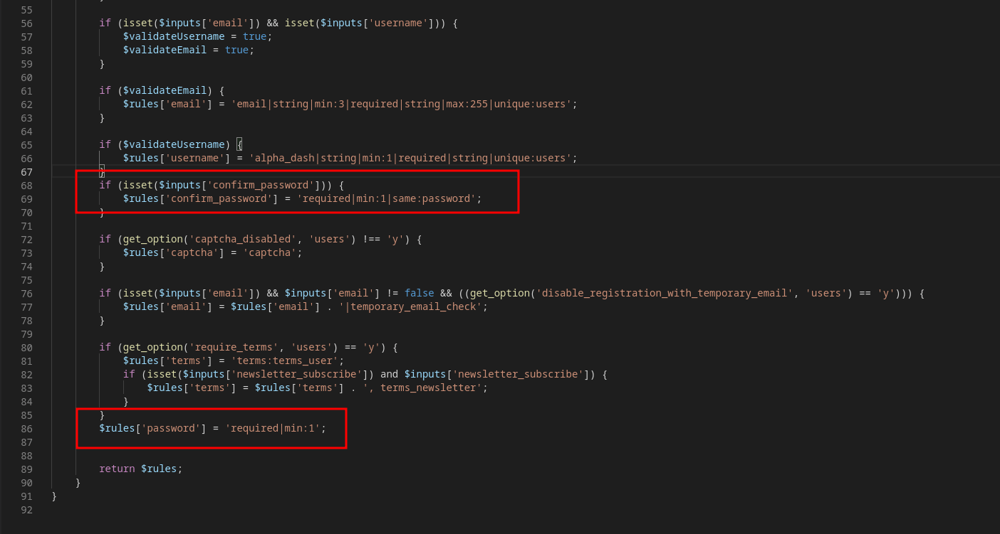
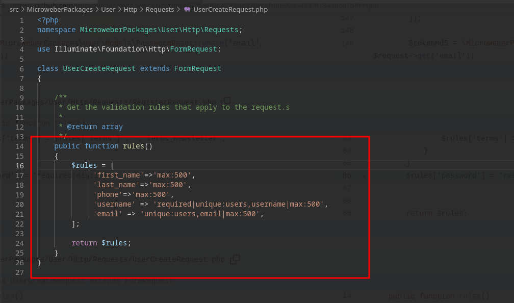
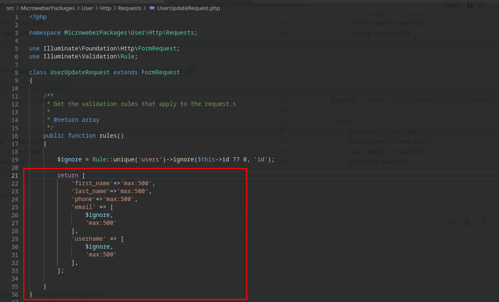
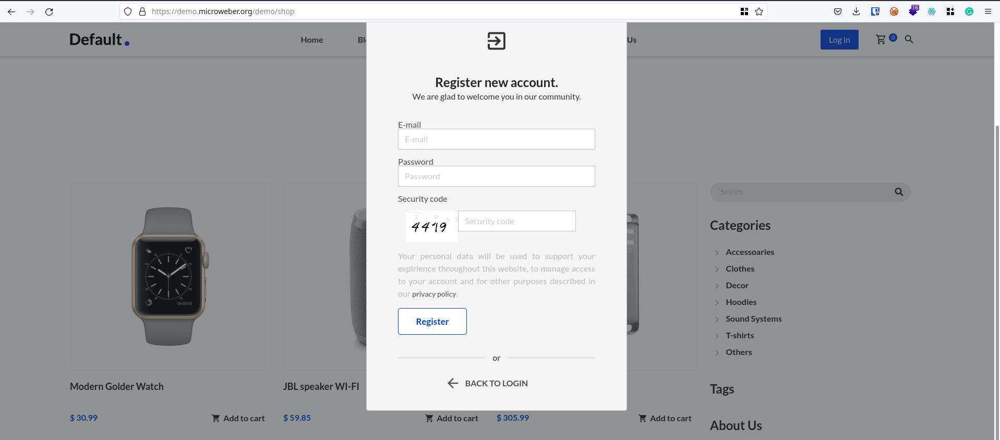
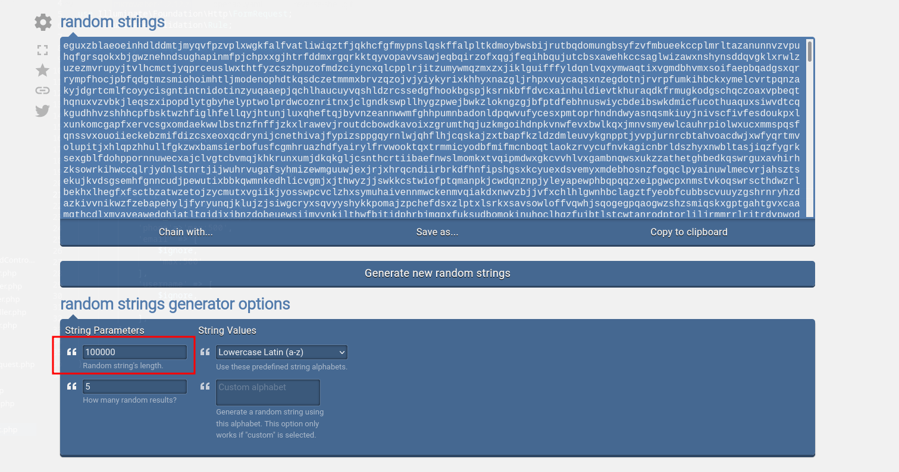
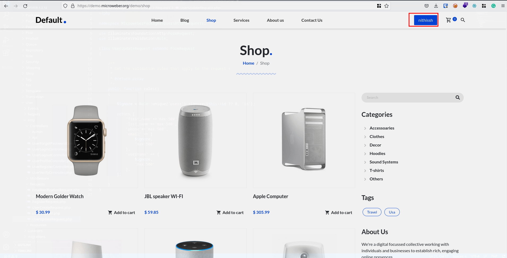
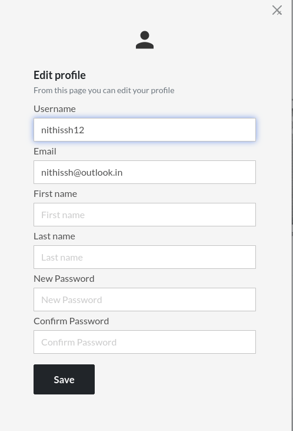
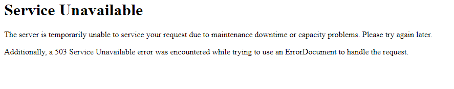

## Introduction

Hello everyone, I'm excited to bring to your attention a fascinating exploration into a vulnerability I uncovered in Microweber CMS while delving into its codebase. This particular issue involves users being able to register an account with an extended password. Subsequently, when attempting to update their profile, the server's prolonged processing time results in application crashes. Join me on this journey as we delve into the intricacies of this discovery.

### Application level DOS attack Explained

Application-level Denial of Service (DoS) is a cyber attack designed to make online applications inaccessible by flooding them with a virtual torrent of internet traffic. This sudden surge overwhelms machines and networks, preventing them from handling incoming requests and causing service shutdowns. Compromised computers, servers, and Internet of Things (IoT) devices are often exploited to execute these attacks.

In these attacks, the focus is often on processes that generate web pages in response to simple HTTP requests. While individual HTTP requests may be small, the cumulative workload required for the server's response can be significantly larger. Threat actors exploit this by bombarding the server with numerous HTTP requests, making it unable to respond to legitimate requests within a practical timeframe. Examples include targeting website forms like login, uploading photos/videos, and submitting feedback.

Detecting and diagnosing application DDoS attacks can be challenging as they mimic genuine website traffic. Even seemingly straightforward Layer 7 attacks, such as targeting login pages with random user IDs and passwords or repeatedly conducting random searches on dynamic websites, can critically overload CPUs and databases. Additionally, threat actors can alter the attack's signatures, enhancing its stealthiness and making detection and prevention more complex.

### Discovery Phase of Vulnerability

During my codebase review, my focus included examining how they manage the signup form, the forgot password page, and user profile updates. While scrutinizing the registration request, I observed that many input fields, including email, password, and confirm password, have been configured with minimum values of 1 character, specifying that the values should be string values.

In the registration request, the email field is limited to a maximum of 255 characters, while the password and confirm password fields do not have a defined maximum character limit.

Upon reviewing the User create functionality, it is observed that the first name, last name, and phone number fields allow registration with a minimum of one character. Additionally, users have the flexibility to provide these details optionally or as mandatory entries.

The provided code lacks password rules, allowing the entry of either a blank password or an unlimited number of characters. Additionally, the User Update Request does not specify password rules, enabling the update of a user profile with an excessively long password.

## Exploitation Phase

First, Let's register for an account in microweber and registration looks like the form below as follows

Please ensure that all mandatory fields are filled out. However, before entering a value into the password field, generate a lengthy string using the [Random string generator](https://onlinetools.com/random/generate-random-string)

Following the generation of a 100k character string, enter it as a password during the registration process. Given that the application lacks predefined rules for password characters, the system will proceed with the request, allowing the registration of an account with a password of the same length as used in the registration form.

If we update the username from **"nithissh"** to **"nithissh12"*** let's observe how the application manages this modification.

The update for the user profile is experiencing an extensive processing time, eventually leading to a system crash.

## Conclusion

In conclusion, I have reported the identified vulnerability in the Microweber application to the development team through the huntr.dev platform. The advisory for this vulnerability has been assigned by huntr.dev, marked as **CVE-2022-1036**